<p align="center">
  
</p>

<p align="center">
  <strong>An append-only, bitemporal ledger database with MVCC snapshot reads and a SQL query interface.</strong>
</p>

<p align="center">
  <a href="https://github.com/spectra-db/SpectraDB/actions"></a>
  <a href="LICENSE"></a>
  <a href="https://www.rust-lang.org"></a>
</p>

---

SpectraDB is a single-node embedded database that treats every write as an immutable fact. It separates the **system timeline** (when data was recorded) from the **business-valid timeline** (when data was true), giving you built-in time travel and auditability with zero application-level bookkeeping.

## Key Features

- **Immutable Fact Ledger** — Write-ahead log with CRC-framed records. Data is never overwritten; updates create new versions.
- **MVCC Snapshot Reads** — Query any past state with `AS OF <commit_ts>`.
- **Bitemporal Filtering** — Separate system and valid-time dimensions with `VALID AT <valid_ts>`.
- **LSM Storage Engine** — Memtable, prefix-compressed SSTables with bloom filters, block index, and mmap reads. Multi-level compaction with configurable size budgets.
- **Block & Index Caching** — LRU caches for SSTable blocks and indexes with configurable memory budgets.
- **SQL Interface** — `CREATE TABLE` (legacy JSON or typed columns), `INSERT`, `SELECT`, `UPDATE`, `DELETE`, `JOIN` (inner/left/right/cross), `GROUP BY`, `HAVING`, subqueries, CTEs, window functions (`ROW_NUMBER`, `RANK`, `DENSE_RANK`, `LEAD`, `LAG`), views, indexes, transactions, `EXPLAIN`, `COPY`.
- **Write Batch API** — Atomic multi-key writes with a single WAL frame for bulk ingest.
- **Streaming Change Feeds** — Subscribe to prefix-filtered change events for real-time downstream consumers.
- **Full-Text Search** — Inverted index facet with tokenizer, stemmer, and posting list intersection.
- **Time-Series** — Bucketed storage with range queries and downsampling (avg/min/max/sum).
- **Interactive Shell** — TAB completion, persistent history, table/line/JSON output modes.
- **Language Bindings** — Python (PyO3) and Node.js (napi-rs) bindings for cross-language access.
- **Optional Native Acceleration** — C++ kernels behind `--features native` via `cxx`, with pure Rust as the default.
- **Optional io_uring** — Linux async I/O for WAL writes and SSTable reads behind `--features io-uring`.
- **Optional SIMD** — Hardware-accelerated bloom probes and checksums behind `--features simd`.

## Who Is This For?

<table>
<tr>
<td width="50%" valign="top">

### Audit & Compliance Systems
Regulations demand provable data history. SpectraDB's append-only ledger with bitemporal queries lets you reconstruct the exact state of any record at any point in time — no application-level versioning required. Use `AS OF` and `VALID AT` to answer "what did we know, and when did we know it?"

</td>
<td width="50%" valign="top">

### Event-Sourced Applications
Use SpectraDB as the append-only event store behind CQRS or event-driven architectures. Write batches provide atomic multi-event commits. Streaming change feeds push events to downstream consumers in real time.

</td>
</tr>
<tr>
<td width="50%" valign="top">

### Temporal Data Management
Model entities with business-valid time ranges — contracts, policies, price schedules — and query them with full SQL including joins, window functions, and aggregates. Ask "what was true on date X?" without building custom versioning logic.

</td>
<td width="50%" valign="top">

### Embedded & Local-First Apps
Ship a full temporal database as a Rust library, Python package, or Node.js module — no server process, no network, no Docker. Ideal for IoT gateways, on-device analytics, and desktop applications.

</td>
</tr>
<tr>
<td width="50%" valign="top">

### Real-Time Monitoring & IoT
The time-series facet handles high-frequency metric ingestion with bucketed storage and downsampling. Combine with change feeds to trigger alerts and downstream processing as data arrives.

</td>
<td width="50%" valign="top">

### Search-Enabled Applications
The full-text search facet provides tokenized, stemmed inverted indexes over document fields. Build search experiences alongside temporal queries without bolting on a separate search service.

</td>
</tr>
</table>

**SpectraDB is a good fit if you need:**
- A complete, queryable history of every change — not just the latest state
- Time travel queries without maintaining versioning logic in your app
- An embedded database that deploys as a library, not a service
- Bitemporal semantics (system time vs. business-valid time) as a first-class primitive
- Real-time change feeds and full-text search in a single embedded engine

**SpectraDB is not the right choice if you need:**
- Distributed multi-node replication
- Petabyte-scale OLAP workloads (consider DuckDB or ClickHouse)
- A drop-in replacement for PostgreSQL or MySQL

## Quickstart

```bash
# Build
cargo build -p spectradb-cli

# Launch interactive shell
cargo run -p spectradb-cli -- --path ./mydb
```

```sql
-- Legacy schema (JSON documents)
CREATE TABLE events (pk TEXT PRIMARY KEY);

INSERT INTO events (pk, doc) VALUES ('evt-1', '{"type":"signup","user":"alice"}');
INSERT INTO events (pk, doc) VALUES ('evt-2', '{"type":"purchase","user":"bob","amount":49.99}');

-- Typed column schema
CREATE TABLE accounts (id INTEGER PRIMARY KEY, name TEXT NOT NULL, balance REAL);

INSERT INTO accounts (id, name, balance) VALUES (1, 'alice', 1000.0);
INSERT INTO accounts (id, name, balance) VALUES (2, 'bob', 500.0);

-- Query latest state
SELECT pk, doc FROM events ORDER BY pk LIMIT 10;

-- Time travel: read state as of commit 1
SELECT doc FROM events WHERE pk='evt-1' AS OF 1;

-- Bitemporal: what was valid at a specific point
SELECT doc FROM events VALID AT 1000;

-- Aggregates and grouping
SELECT count(*), sum(doc.amount) FROM events GROUP BY doc.type HAVING count(*) > 1;

-- Window functions
SELECT pk, doc, ROW_NUMBER() OVER (ORDER BY pk) AS rn FROM events;

-- Joins
SELECT e.pk, a.name FROM events e JOIN accounts a ON e.doc.user = a.name;

-- UPDATE and DELETE
UPDATE events SET doc = '{"type":"refund","user":"bob"}' WHERE pk = 'evt-2';
DELETE FROM events WHERE pk = 'evt-1';

-- Transactions
BEGIN;
INSERT INTO events (pk, doc) VALUES ('evt-3', '{"type":"refund","user":"bob"}');
COMMIT;
```

## Architecture

SpectraDB is organized around three core principles: **immutable truth** (the append-only ledger), **temporal indexing** (bitemporal metadata on every fact), and **faceted queries** (pluggable query planes over the same data).

```mermaid
graph TB
    subgraph Client Layer
        CLI[Interactive Shell]
        API[Rust API<br/><code>db.sql&#40;...&#41;</code>]
        PY[Python Bindings<br/>PyO3]
        NODE[Node.js Bindings<br/>napi-rs]
    end

    subgraph Query Engine
        Parser[SQL Parser<br/>expressions · CTEs · window funcs]
        Executor[Query Executor<br/>scans · joins · aggregates · windows]
        Planner[Explain Planner]
    end

    subgraph Facet Layer
        RF[Relational Facet<br/>tables · views · indexes · typed schema]
        FTS[Full-Text Search<br/>inverted index · stemmer]
        TS[Time-Series Facet<br/>buckets · downsample]
    end

    subgraph Shard Engine
        direction LR
        S0[Shard 0]
        S1[Shard 1]
        SN[Shard N]
    end

    CF[Change Feeds<br/>prefix-filtered subscriptions]

    subgraph Storage Engine
        WAL[Write-Ahead Log<br/>CRC-framed · batch writes · fsync]
        MT[Memtable<br/>sorted in-memory map]
        BC[Block & Index Cache<br/>LRU · configurable budgets]
        SST[SSTables<br/>bloom · prefix compression · mmap]
        C[Multi-Level Compaction<br/>L0 → L1 → ... · size-budgeted]
    end

    MF[Manifest<br/>per-level file tracking]

    CLI --> Parser
    API --> Parser
    PY --> API
    NODE --> API
    Parser --> Executor
    Executor --> RF
    Executor --> Planner
    RF --> S0
    RF --> S1
    RF --> SN
    FTS --> S0
    TS --> S0
    S0 --> CF
    S1 --> CF
    SN --> CF
    S0 --> WAL
    S1 --> WAL
    SN --> WAL
    WAL --> MT
    MT -->|flush| SST
    SST --> BC
    SST --> C
    S0 --> MF
    S1 --> MF
    SN --> MF
```



### Write Path

1. **Route** — Key is hashed to a shard (`hash(key) % shard_count`).
2. **Log** — Fact is appended to the shard's WAL with a CRC frame (single or batch).
3. **Notify** — Matching change feed subscribers receive the event.
4. **Buffer** — Entry is inserted into the in-memory memtable.
5. **Flush** — When the memtable exceeds `memtable_max_bytes`, it is frozen and written as a prefix-compressed SSTable.
6. **Compact** — Multi-level compaction promotes SSTables through L0 → L1 → ... with size-budgeted thresholds. All temporal versions are preserved.

### Read Path

1. **Cache Check** — LRU block and index caches serve hot data without disk I/O.
2. **Bloom Check** — If the bloom filter says the key is absent, skip the SSTable.
3. **Memtable Scan** — Check the active memtable for the latest version.
4. **Level Lookup** — L0: search all files newest-first. L1+: binary search for the single overlapping file per level.
5. **Temporal Filter** — Apply `AS OF` (system time) and `VALID AT` (business time) predicates.
6. **Merge** — Return the most recent version satisfying all filters.

### Key Design Decisions

| Decision | Rationale |
|----------|-----------|
| Append-only writes | Immutability simplifies recovery, enables time travel, eliminates in-place update corruption |
| Single writer per shard | Avoids fine-grained locking while allowing parallel writes across shards |
| Bitemporal timestamps | Separates "when recorded" from "when true" — a requirement for audit and compliance workloads |
| Multi-level compaction | Size-budgeted leveling reduces read amplification while preserving all temporal versions |
| Block/index caching | LRU caches reduce disk I/O for hot working sets without requiring mmap for everything |
| Dual schema modes | Legacy JSON documents for flexibility; typed columns for structure and performance |

## Performance

SpectraDB ships with a built-in benchmark harness:

```bash
cargo run -p spectradb-cli -- --path /tmp/bench bench \
  --write-ops 100000 --read-ops 50000 --keyspace 20000 --read-miss-ratio 0.20
```

Sample numbers (single machine, sanity run):

| Metric | Value |
|--------|-------|
| Write throughput | ~4,500 ops/s |
| Read p50 latency | ~530 µs |
| Read p95 latency | ~890 µs |
| Read p99 latency | ~1,030 µs |

Tuning knobs: `--wal-fsync-every-n-records`, `--memtable-max-bytes`, `--sstable-block-bytes`, `--bloom-bits-per-key`, `--shard-count`. See [perf.md](perf.md) for details.

## Completed Releases

<details>
<summary><strong>v0.2 — Query Engine</strong> ✅</summary>

- [x] Expression AST with full precedence parsing (OR, AND, NOT, comparisons, arithmetic)
- [x] General `WHERE` clauses with comparison operators and field access
- [x] `UPDATE` and `DELETE` with temporal-aware semantics
- [x] General-purpose `JOIN` (inner, left, right, cross) with arbitrary ON clauses
- [x] Richer aggregates: `SUM`, `AVG`, `MIN`, `MAX`
- [x] `GROUP BY` on arbitrary expressions
- [x] `HAVING` clause
</details>

<details>
<summary><strong>v0.3 — Storage & Performance</strong> ✅</summary>

- [x] Multi-level compaction with size-budgeted leveling (L0 → L1 → ... → L7)
- [x] Block and index caching with configurable memory budgets (LRU)
- [x] Prefix compression and restart points in SSTable blocks (V2 format)
- [x] Write-batch API for atomic multi-key bulk ingest
- [x] SIMD-accelerated bloom probes and checksums (behind `--features simd`)
</details>

<details>
<summary><strong>v0.4 — SQL Surface & Developer Experience</strong> ✅</summary>

- [x] Subqueries, CTEs (`WITH ... AS`)
- [x] Window functions: `ROW_NUMBER`, `RANK`, `DENSE_RANK`, `LEAD`, `LAG`
- [x] Typed column schema with DDL enforcement (`INTEGER`, `REAL`, `TEXT`, `BOOLEAN`, `BLOB`)
- [x] Columnar row encoding with null bitmaps
- [x] Index-backed query execution
- [x] `COPY` for bulk import/export
- [x] Python bindings (PyO3)
- [x] Node.js bindings (napi-rs)
</details>

<details>
<summary><strong>v0.5 — Ecosystem</strong> ✅</summary>

- [x] Full-text search facet (inverted index, tokenizer, stemmer)
- [x] Time-series facet (bucketed storage, downsampling, range queries)
- [x] Streaming change feeds with prefix-filtered subscriptions
- [x] io_uring async I/O for WAL writes and SSTable reads (behind `--features io-uring`)
- [x] Comparative benchmark harness
</details>

## Roadmap

### v0.6 — Distributed Foundations
- [ ] Write-ahead log replication (leader-follower)
- [ ] Snapshot-based backup and restore (`BACKUP TO` / `RESTORE FROM`)
- [ ] Point-in-time recovery from WAL replay
- [ ] Pluggable transport layer for replication (TCP, Unix sockets)

### v0.7 — Advanced Query Engine
- [ ] Cost-based query optimizer with statistics
- [ ] Parallel query execution across shards
- [ ] Materialized views with incremental refresh
- [ ] Prepared statements and query plan caching
- [ ] `ORDER BY` on arbitrary expressions with external merge sort

### v0.8 — Extended Type System & Analytics
- [ ] JSON/JSONB native column type with path indexing
- [ ] Array and nested struct column types
- [ ] User-defined functions (Rust plugin API)
- [ ] Approximate aggregates: `COUNT DISTINCT` (HyperLogLog), percentiles (t-digest)
- [ ] `EXPLAIN ANALYZE` with runtime statistics

### v0.9 — Production Hardening
- [ ] Encryption at rest (AES-256-GCM per SSTable block)
- [ ] Role-based access control for SQL operations
- [ ] Connection pooling and multi-tenant isolation
- [ ] Crash recovery fuzzing and Jepsen-style testing
- [ ] Memory-mapped I/O with `O_DIRECT` bypass option

### v1.0 — Stable Release
- [ ] Stable on-disk format with forward-compatibility guarantees
- [ ] Comprehensive documentation and migration guides
- [ ] Published crates on crates.io, PyPI, and npm
- [ ] Long-term support policy

See [design.md](design.md) for the full architecture specification.

## Project Structure

```
spectradb/
├── crates/
│   ├── spectradb-core/        # Storage engine, SQL parser/executor, facets
│   │   └── src/
│   │       ├── engine/        # Database, shard runtime, change feeds
│   │       ├── storage/       # SSTable, WAL, compaction, levels, cache, columnar
│   │       ├── sql/           # Parser, executor, evaluator, planner
│   │       ├── facet/         # Relational, full-text search, time-series
│   │       ├── io/            # io_uring async I/O (optional)
│   │       └── util/          # Bloom filters, varint, checksums
│   ├── spectradb-cli/         # Interactive shell and CLI commands
│   ├── spectradb-native/      # Optional C++ acceleration (cxx)
│   ├── spectradb-python/      # Python bindings (PyO3 / maturin)
│   └── spectradb-node/        # Node.js bindings (napi-rs)
├── tests/                     # Integration tests (100+ tests)
├── benches/                   # Criterion benchmarks (basic + comparative)
├── scripts/                   # Benchmark matrix, overnight burn-in
├── design.md                  # Architecture deep dive
├── perf.md                    # Performance notes and tuning guide
└── TEST_PLAN.md               # Validation strategy
```

## Documentation

| Document | Description |
|----------|-------------|
| [design.md](design.md) | Internal architecture, data model, storage format |
| [perf.md](perf.md) | Tuning knobs, benchmark methodology, optimization roadmap |
| [TEST_PLAN.md](TEST_PLAN.md) | Correctness, recovery, temporal, and soak test strategy |
| [CONTRIBUTING.md](CONTRIBUTING.md) | Development setup and contribution guidelines |
| [CHANGELOG.md](CHANGELOG.md) | Release history |

## Building

```bash
# Pure Rust (default)
cargo test

# With C++ acceleration
cargo test --features native

# With SIMD-accelerated bloom probes and checksums
cargo test --features simd

# With io_uring async I/O (Linux only)
cargo test --features io-uring

# Run benchmarks
cargo bench

# Build Python bindings
cd crates/spectradb-python && maturin develop

# Build Node.js bindings
cd crates/spectradb-node && npm run build
```

## Contributing

We welcome contributions. Please read [CONTRIBUTING.md](CONTRIBUTING.md) before opening a pull request.

## License

SpectraDB is licensed under the [MIT License](LICENSE).
