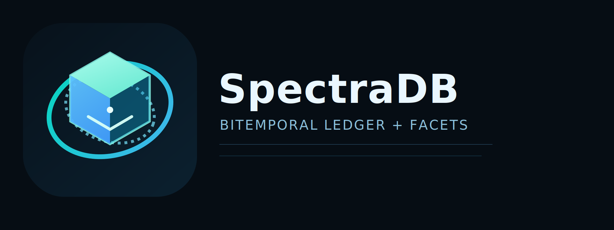

<p align="center">
  
</p>

<p align="center">
  <strong>An append-only, bitemporal ledger database with MVCC snapshot reads and a SQL query interface.</strong>
</p>

<p align="center">
  <a href="https://github.com/spectra-db/SpectraDB/actions"></a>
  <a href="LICENSE"></a>
  <a href="https://www.rust-lang.org"></a>
</p>

---

SpectraDB is a single-node embedded database that treats every write as an immutable fact. It separates the **system timeline** (when data was recorded) from the **business-valid timeline** (when data was true), giving you built-in time travel and auditability with zero application-level bookkeeping.

## Key Features

- **Immutable Fact Ledger** — Write-ahead log with CRC-framed records. Data is never overwritten; updates create new versions.
- **MVCC Snapshot Reads** — Query any past state with `AS OF <commit_ts>`.
- **Bitemporal Filtering** — Separate system and valid-time dimensions with `VALID AT <valid_ts>`.
- **LSM Storage Engine** — Memtable, prefix-compressed SSTables with bloom filters, block index, and mmap reads. Multi-level compaction with configurable size budgets.
- **Block & Index Caching** — LRU caches for SSTable blocks and indexes with configurable memory budgets.
- **SQL Interface** — `CREATE TABLE` (legacy JSON or typed columns), `INSERT`, `SELECT`, `UPDATE`, `DELETE`, `JOIN` (inner/left/right/cross), `GROUP BY`, `HAVING`, subqueries, CTEs, window functions (`ROW_NUMBER`, `RANK`, `DENSE_RANK`, `LEAD`, `LAG`), views, indexes, transactions, `EXPLAIN`, `COPY`.
- **Write Batch API** — Atomic multi-key writes with a single WAL frame for bulk ingest.
- **Embedded AI Insight Runtime** — Optional async copilot pipeline (`--ai-auto-insights`) that runs natively in-process, consumes change feeds, synthesizes operational insights, and stores them as immutable internal facts.
- **Streaming Change Feeds** — Subscribe to prefix-filtered change events for real-time downstream consumers.
- **Full-Text Search** — Inverted index facet with tokenizer, stemmer, and posting list intersection.
- **Time-Series** — Bucketed storage with range queries and downsampling (avg/min/max/sum).
- **Interactive Shell** — TAB completion, persistent history, table/line/JSON output modes.
- **Language Bindings** — Python (PyO3) and Node.js (napi-rs) bindings for cross-language access.
- **Optional Native Acceleration** — C++ kernels behind `--features native` via `cxx`, with pure Rust as the default.
- **Optional io_uring** — Linux async I/O for WAL writes and SSTable reads behind `--features io-uring`.
- **Optional SIMD** — Hardware-accelerated bloom probes and checksums behind `--features simd`.

## Who Is This For?

<table>
<tr>
<td width="50%" valign="top">

### Audit & Compliance Systems
Regulations demand provable data history. SpectraDB's append-only ledger with bitemporal queries lets you reconstruct the exact state of any record at any point in time — no application-level versioning required. Use `AS OF` and `VALID AT` to answer "what did we know, and when did we know it?"

</td>
<td width="50%" valign="top">

### Event-Sourced Applications
Use SpectraDB as the append-only event store behind CQRS or event-driven architectures. Write batches provide atomic multi-event commits. Streaming change feeds push events to downstream consumers in real time.

</td>
</tr>
<tr>
<td width="50%" valign="top">

### Temporal Data Management
Model entities with business-valid time ranges — contracts, policies, price schedules — and query them with full SQL including joins, window functions, and aggregates. Ask "what was true on date X?" without building custom versioning logic.

</td>
<td width="50%" valign="top">

### Embedded & Local-First Apps
Ship a full temporal database as a Rust library, Python package, or Node.js module — no server process, no network, no Docker. Ideal for IoT gateways, on-device analytics, and desktop applications.

</td>
</tr>
<tr>
<td width="50%" valign="top">

### Real-Time Monitoring & IoT
The time-series facet handles high-frequency metric ingestion with bucketed storage and downsampling. Combine with change feeds to trigger alerts and downstream processing as data arrives.

</td>
<td width="50%" valign="top">

### Search-Enabled Applications
The full-text search facet provides tokenized, stemmed inverted indexes over document fields. Build search experiences alongside temporal queries without bolting on a separate search service.

</td>
</tr>
</table>

**SpectraDB is a good fit if you need:**
- A complete, queryable history of every change — not just the latest state
- Time travel queries without maintaining versioning logic in your app
- An embedded database that deploys as a library, not a service
- Bitemporal semantics (system time vs. business-valid time) as a first-class primitive
- Real-time change feeds and full-text search in a single embedded engine

**SpectraDB is not the right choice if you need:**
- Distributed multi-node replication
- Petabyte-scale OLAP workloads (consider DuckDB or ClickHouse)
- A drop-in replacement for PostgreSQL or MySQL

## Quickstart

```bash
# Run examples
cargo run --example quickstart     # Core features: SQL, time-travel, prepared statements
cargo run --example bitemporal     # Bitemporal ledger: AS OF + VALID AT queries
cargo run --example ai_native      # AI runtime: insights, risk scoring, query planning

# Build
cargo build -p spectradb-cli

# Launch interactive shell
cargo run -p spectradb-cli -- --path ./mydb

# Launch shell with AI auto-insights enabled
cargo run -p spectradb-cli -- --path ./mydb --ai-auto-insights

# Use Tier-0 in-core AI runtime
cargo run -p spectradb-cli -- --path ./mydb --ai-auto-insights \
  --ai-batch-window-ms 20 \
  --ai-batch-max-events 16
```

```sql
-- Legacy schema (JSON documents)
CREATE TABLE events (pk TEXT PRIMARY KEY);

INSERT INTO events (pk, doc) VALUES ('evt-1', '{"type":"signup","user":"alice"}');
INSERT INTO events (pk, doc) VALUES ('evt-2', '{"type":"purchase","user":"bob","amount":49.99}');

-- Typed column schema
CREATE TABLE accounts (id INTEGER PRIMARY KEY, name TEXT NOT NULL, balance REAL);

INSERT INTO accounts (id, name, balance) VALUES (1, 'alice', 1000.0);
INSERT INTO accounts (id, name, balance) VALUES (2, 'bob', 500.0);

-- Query latest state
SELECT pk, doc FROM events ORDER BY pk LIMIT 10;

-- Time travel: read state as of commit 1
SELECT doc FROM events WHERE pk='evt-1' AS OF 1;

-- Bitemporal: what was valid at a specific point
SELECT doc FROM events VALID AT 1000;

-- Aggregates and grouping
SELECT count(*), sum(doc.amount) FROM events GROUP BY doc.type HAVING count(*) > 1;

-- Window functions
SELECT pk, doc, ROW_NUMBER() OVER (ORDER BY pk) AS rn FROM events;

-- Joins
SELECT pk, doc FROM events JOIN accounts ON events.pk=accounts.pk ORDER BY pk ASC;

-- UPDATE and DELETE
UPDATE events SET doc = '{"type":"refund","user":"bob"}' WHERE pk = 'evt-2';
DELETE FROM events WHERE pk = 'evt-1';

-- Transactions
BEGIN;
INSERT INTO events (pk, doc) VALUES ('evt-3', '{"type":"refund","user":"bob"}');
COMMIT;

-- Shell AI ops commands
.ai_status
.ai table/events/evt-3 5
.ai_timeline table/events/evt-3 20
.ai_correlate table/events/evt-3 20
# grab an insight_id from .ai output first
.ai_explain <insight-id>
```

Native AI note:
- AI auto-insights run fully in-process in the core engine.
- No external model server/process is required.

## Architecture

SpectraDB is organized around three core principles: **immutable truth** (the append-only ledger), **temporal indexing** (bitemporal metadata on every fact), and **faceted queries** (pluggable query planes over the same data).

```mermaid
graph TB
    subgraph Client Layer
        CLI[Interactive Shell]
        API[Rust API<br/><code>db.sql&#40;...&#41;</code>]
        PY[Python Bindings<br/>PyO3]
        NODE[Node.js Bindings<br/>napi-rs]
    end

    subgraph Query Engine
        Parser[SQL Parser<br/>expressions · CTEs · window funcs]
        Executor[Query Executor<br/>scans · joins · aggregates · windows]
        Planner[Explain Planner]
    end

    subgraph Facet Layer
        RF[Relational Facet<br/>tables · views · indexes · typed schema]
        FTS[Full-Text Search<br/>inverted index · stemmer]
        TS[Time-Series Facet<br/>buckets · downsample]
    end

    subgraph Shard Engine
        direction LR
        S0[Shard 0]
        S1[Shard 1]
        SN[Shard N]
    end

    CF[Change Feeds<br/>prefix-filtered subscriptions]

    subgraph Storage Engine
        WAL[Write-Ahead Log<br/>CRC-framed · batch writes · fsync]
        MT[Memtable<br/>sorted in-memory map]
        BC[Block & Index Cache<br/>LRU · configurable budgets]
        SST[SSTables<br/>bloom · prefix compression · mmap]
        C[Multi-Level Compaction<br/>L0 → L1 → ... · size-budgeted]
    end

    MF[Manifest<br/>per-level file tracking]

    CLI --> Parser
    API --> Parser
    PY --> API
    NODE --> API
    Parser --> Executor
    Executor --> RF
    Executor --> Planner
    RF --> S0
    RF --> S1
    RF --> SN
    FTS --> S0
    TS --> S0
    S0 --> CF
    S1 --> CF
    SN --> CF
    S0 --> WAL
    S1 --> WAL
    SN --> WAL
    WAL --> MT
    MT -->|flush| SST
    SST --> BC
    SST --> C
    S0 --> MF
    S1 --> MF
    SN --> MF
```



### Write Path

1. **Route** — Key is hashed to a shard (`hash(key) % shard_count`).
2. **Log** — Fact is appended to the shard's WAL with a CRC frame (single or batch).
3. **Notify** — Matching change feed subscribers receive the event.
4. **Buffer** — Entry is inserted into the in-memory memtable.
5. **Flush** — When the memtable exceeds `memtable_max_bytes`, it is frozen and written as a prefix-compressed SSTable.
6. **Compact** — Multi-level compaction promotes SSTables through L0 → L1 → ... with size-budgeted thresholds. All temporal versions are preserved.

### Read Path

1. **Cache Check** — LRU block and index caches serve hot data without disk I/O.
2. **Bloom Check** — If the bloom filter says the key is absent, skip the SSTable.
3. **Memtable Scan** — Check the active memtable for the latest version.
4. **Level Lookup** — L0: search all files newest-first. L1+: binary search for the single overlapping file per level.
5. **Temporal Filter** — Apply `AS OF` (system time) and `VALID AT` (business time) predicates.
6. **Merge** — Return the most recent version satisfying all filters.

### Key Design Decisions

| Decision | Rationale |
|----------|-----------|
| Append-only writes | Immutability simplifies recovery, enables time travel, eliminates in-place update corruption |
| Single writer per shard | Avoids fine-grained locking while allowing parallel writes across shards |
| Bitemporal timestamps | Separates "when recorded" from "when true" — a requirement for audit and compliance workloads |
| Multi-level compaction | Size-budgeted leveling reduces read amplification while preserving all temporal versions |
| Block/index caching | LRU caches reduce disk I/O for hot working sets without requiring mmap for everything |
| Dual schema modes | Legacy JSON documents for flexibility; typed columns for structure and performance |

## Performance

SpectraDB ships with a built-in benchmark harness:

```bash
cargo run -p spectradb-cli -- --path /tmp/bench bench \
  --write-ops 100000 --read-ops 50000 --keyspace 20000 --read-miss-ratio 0.20
```

Sample numbers (single machine, sanity run):

| Metric | Value |
|--------|-------|
| Write throughput | ~4,500 ops/s |
| Read p50 latency | ~530 µs |
| Read p95 latency | ~890 µs |
| Read p99 latency | ~1,030 µs |

Tuning knobs: `--wal-fsync-every-n-records`, `--memtable-max-bytes`, `--sstable-block-bytes`, `--bloom-bits-per-key`, `--shard-count`. See [perf.md](perf.md) for details.

AI overhead gate (CI/local):

```bash
./scripts/ai_overhead_gate.sh
```

Release AI overhead report:

```bash
./scripts/release_ai_report.sh
```

Executable docs note:
- Quickstart SQL/AI examples are validated in [tests/readme_examples.rs](tests/readme_examples.rs).

## Completed Releases

<details>
<summary><strong>v0.2 — Query Engine</strong> ✅</summary>

- [x] Expression AST with full precedence parsing (OR, AND, NOT, comparisons, arithmetic)
- [x] General `WHERE` clauses with comparison operators and field access
- [x] `UPDATE` and `DELETE` with temporal-aware semantics
- [x] General-purpose `JOIN` (inner, left, right, cross) with arbitrary ON clauses
- [x] Richer aggregates: `SUM`, `AVG`, `MIN`, `MAX`
- [x] `GROUP BY` on arbitrary expressions
- [x] `HAVING` clause
</details>

<details>
<summary><strong>v0.3 — Storage & Performance</strong> ✅</summary>

- [x] Multi-level compaction with size-budgeted leveling (L0 → L1 → ... → L7)
- [x] Block and index caching with configurable memory budgets (LRU)
- [x] Prefix compression and restart points in SSTable blocks (V2 format)
- [x] Write-batch API for atomic multi-key bulk ingest
- [x] SIMD-accelerated bloom probes and checksums (behind `--features simd`)
</details>

<details>
<summary><strong>v0.4 — SQL Surface & Developer Experience</strong> ✅</summary>

- [x] Subqueries, CTEs (`WITH ... AS`)
- [x] Window functions: `ROW_NUMBER`, `RANK`, `DENSE_RANK`, `LEAD`, `LAG`
- [x] Typed column schema with DDL enforcement (`INTEGER`, `REAL`, `TEXT`, `BOOLEAN`, `BLOB`)
- [x] Columnar row encoding with null bitmaps
- [x] Index-backed query execution
- [x] `COPY` for bulk import/export
- [x] Python bindings (PyO3)
- [x] Node.js bindings (napi-rs)
</details>

<details>
<summary><strong>v0.5 — Ecosystem</strong> ✅</summary>

- [x] Full-text search facet (inverted index, tokenizer, stemmer)
- [x] Time-series facet (bucketed storage, downsampling, range queries)
- [x] Streaming change feeds with prefix-filtered subscriptions
- [x] io_uring async I/O for WAL writes and SSTable reads (behind `--features io-uring`)
- [x] Comparative benchmark harness
</details>

## Roadmap

> **Strategy**: Fix foundations → Make it fast → Own the niche (bitemporal + AI + embedded) → Speak Postgres → Then expand. Each version builds on the last. Nothing ships until the layer below is solid.

---

### PHASE 1: MAKE IT CORRECT

#### v0.6 — Storage Correctness
**No one deploys a database with data loss bugs. This is table stakes.**
- [ ] Persist per-level file metadata in manifest — fix the critical bug where all SSTables reload as L0 on restart, destroying level separation and triggering full re-compaction every time
- [ ] Wire block cache into SSTable reader — caches are allocated and passed to shards but stored as `_block_cache` (unused). Integrate into `get_visible()` and block reads
- [ ] Wire index cache into SSTable reader — same issue. Index lookups should hit cache before disk
- [ ] Implement immutable memtable queue — `flush_active_memtable` replaces the memtable but never pushes to `immutable_memtables`. Implement freeze → queue → background flush pipeline
- [ ] Fix `get_visible` binary search — index probe uses `user_key + 0x00` as target against internal keys. This can skip blocks containing valid temporal versions
- [ ] Typed DELETE tombstone — replace empty-value tombstone with a typed marker so compaction can GC expired tombstones and empty docs aren't confused with deletes
- [ ] Tombstone TTL in compaction — after a configurable retention period, compaction drops tombstones older than the oldest active snapshot
- [ ] WAL rotation — replace single-file truncation with file-per-generation. Archive old WAL segments for point-in-time recovery
- [ ] WAL checksum upgrade — add per-batch CRC in addition to per-record CRC for batch write integrity
- [ ] Manifest versioning — add format version to manifest JSON so future changes can migrate
- [ ] Crash recovery test suite — random kill during flush, compaction, and manifest write with automated integrity verification on restart

#### v0.7 — SQL Correctness
**Every query must return the right answer. Fix semantic bugs before adding features.**
- [ ] Fix numeric ORDER BY — `to_sort_string()` sorts numbers lexicographically ("10" < "9"). Implement typed comparison with numeric-aware sorting
- [ ] Fix window function evaluation order — windows are computed after LIMIT, which is wrong. Correct order: FROM → WHERE → GROUP BY → HAVING → window functions → ORDER BY → LIMIT
- [ ] Transaction-local reads — `SELECT` inside `BEGIN..COMMIT` must see own staged writes. Merge `SqlSession.pending` into table scans, not just exact-key lookups
- [ ] `ROLLBACK` correctness — verify pending writes are fully discarded and no partial state leaks
- [ ] `UPDATE` bitemporal preservation — `UPDATE` currently writes `valid_from=0, valid_to=MAX`, discarding the original temporal interval. Preserve or allow explicit temporal UPDATE syntax
- [ ] `NULL` handling audit — verify three-valued logic across all comparisons, aggregates, `GROUP BY`, `ORDER BY`, `DISTINCT`, and `JOIN` conditions per SQL standard
- [ ] `ORDER BY` with aliases — `SELECT col AS x ... ORDER BY x` should resolve aliases
- [ ] `GROUP BY` ordinal — `SELECT col, count(*) FROM t GROUP BY 1` should work
- [ ] Quoted identifiers — support `"column name"` for reserved words and special characters
- [ ] Error position reporting — parser errors should include line/column for multi-line queries

#### v0.8 — Wire Unused Subsystems
**Every feature claimed in docs must actually work end-to-end.**
- [ ] Wire columnar encoding into typed table path — typed `INSERT`/`SELECT` currently serialize to JSON. Route through `columnar.rs` `encode_row`/`decode_row` for real typed storage
- [ ] Wire io_uring into WAL writes — `UringWalWriter` exists but `Wal` uses synchronous I/O. Add feature-gated io_uring path in `Wal::append` and `Wal::sync`
- [ ] Wire io_uring into SSTable reads — `UringBlockReader` exists but `SsTableReader` uses mmap. Add async read path for large sequential scans
- [ ] Implement real secondary indexes — `CREATE INDEX` is metadata-only. Build B-tree index structure backed by SSTables, maintained on INSERT/UPDATE/DELETE
- [ ] Implement `ALTER TABLE ADD COLUMN` backfill — currently metadata-only. Existing rows should return NULL or default for the new column
- [ ] Implement `CREATE VIEW` as stored query — currently limited to pk-lookup template. Store arbitrary SELECT and resolve at query time
- [ ] Validate `COPY TO/FROM` end-to-end — no integration tests exist for CSV, JSON, or NDJSON import/export. Add tests and fix issues
- [ ] Multi-shard test coverage — all SQL integration tests use `shard_count: 1`. Add tests with `shard_count: 4` to verify cross-shard correctness

---

### PHASE 2: MAKE IT FAST

#### v0.9 — Storage Performance
**Get reads and writes to compete with SQLite and DuckDB on single-node throughput.**
- [ ] LRU eviction for block cache — current FIFO eviction is suboptimal. Implement clock or LRU-K eviction policy
- [ ] Adaptive block cache sizing — auto-tune cache size based on working set and hit rate
- [ ] Predicate pushdown to SSTable — push WHERE clauses into `scan_prefix` so blocks can skip non-matching entries without deserializing
- [ ] Bloom filter for range scans — current bloom only works for point lookups. Add prefix bloom filter for `scan_prefix` operations
- [ ] Parallel memtable flush — flush immutable memtables on a background thread pool instead of blocking the shard actor
- [ ] Compaction I/O throttling — rate-limit compaction disk I/O to avoid starving foreground reads/writes
- [ ] Compression — LZ4 for L0-L2 (speed-optimized), Zstd for L3+ (ratio-optimized). Configurable per-level
- [ ] Direct I/O (`O_DIRECT`) option — bypass page cache for WAL writes and large sequential SSTable reads on Linux
- [ ] Batched WAL fsync — group multiple WAL appends into a single fsync call with configurable group commit window
- [ ] SSTable bloom filter false positive tracking — log bloom FP rate per level to auto-tune `bits_per_key`
- [ ] Memtable arena allocator — reduce allocation overhead with bump allocation for memtable entries

#### v0.10 — Query Engine Performance
**Replace full-table scans with indexed execution. This is where 1000x speedups come from.**
- [x] Table statistics collection — track row count, distinct value count, min/max per column, value frequency histograms via `ANALYZE <table>`
- [x] Cost-based query planner — real plan tree with `PlanNode` types (PointLookup, FullScan, Filter, HashJoin, Sort, Limit, Project) and cost estimation
- [ ] Index scan execution — for queries with `WHERE pk = ?` or `WHERE indexed_col = ?`, use the index instead of full table scan
- [ ] Composite index scans — multi-column indexes with prefix matching for `WHERE a = ? AND b = ?`
- [ ] Index-only scans — if all SELECT columns are in the index, return directly without hitting data blocks
- [ ] Hash join — for equi-joins on large tables, build hash table on smaller side, probe with larger
- [ ] Sort-merge join — for pre-sorted inputs or when both sides have compatible indexes
- [ ] Parallel shard execution — fan out scan/aggregate across shards on separate threads, merge results
- [ ] External merge sort — for ORDER BY on datasets larger than `memtable_max_bytes`, spill to temp SSTables
- [x] `EXPLAIN ANALYZE` — shows execution time, rows returned, read/write/bloom ops, and plan cost per operator
- [x] Prepared statements — parse once, execute many with `$1, $2, ...` parameter binding and plan caching
- [ ] Expression compilation — compile hot WHERE predicates to closure-based evaluation (skip interpreter overhead)

---

### PHASE 3: OWN THE NICHE

#### v0.11 — Temporal SQL Standard (SQL:2011)
**This is SpectraDB's killer differentiator. No embedded DB does this. Make it standards-compliant.**
- [ ] `SYSTEM_TIME` period definition — `CREATE TABLE ... WITH SYSTEM VERSIONING` per SQL:2011
- [x] `FOR SYSTEM_TIME AS OF <timestamp>` — standard syntax alongside existing `AS OF`
- [x] `FOR SYSTEM_TIME FROM <t1> TO <t2>` — range query over system time
- [x] `FOR SYSTEM_TIME BETWEEN <t1> AND <t2>` — inclusive range
- [x] `APPLICATION_TIME` period definition — `PERIOD FOR valid_time (valid_from, valid_to)` column pairs
- [x] `FOR APPLICATION_TIME AS OF <t>` — application/business time point queries
- [x] `FOR APPLICATION_TIME FROM <t1> TO <t2>` — application time range queries
- [ ] Temporal `UPDATE` — `UPDATE ... FOR PORTION OF valid_time FROM <t1> TO <t2>` with period splitting
- [ ] Temporal `DELETE` — `DELETE ... FOR PORTION OF valid_time FROM <t1> TO <t2>`
- [ ] Bitemporal diff — `SELECT * FROM table FOR SYSTEM_TIME AS OF <t1> EXCEPT SELECT * FROM table FOR SYSTEM_TIME AS OF <t2>` — show exactly what changed between two snapshots
- [ ] `TEMPORAL JOIN` — join two temporal tables with period overlap matching (Allen's interval algebra)
- [ ] Temporal coalescing — merge adjacent/overlapping periods with identical values into single rows
- [ ] Temporal primary key — uniqueness enforced per time period, not just per row
- [x] `SYSTEM_TIME ALL` — return all historical versions of a row
- [ ] Temporal schema migration — `ALTER TABLE ADD SYSTEM VERSIONING` on existing tables, backfill system time

#### v0.12 — AI Runtime v2
**Evolve from keyword matching to a real ML-powered reasoning engine.**
- [ ] `ModelBackend` trait — pluggable interface with `synthesize(&self, text: &str) -> ModelOutput`
- [ ] Built-in backends: `core-ai` (current rules), `onnx` (ONNX Runtime), `http` (external API)
- [ ] Anomaly detection — maintain rolling statistics (mean, stddev) per key prefix. Flag z-score > 3 as anomalous
- [ ] Pattern learning — track recurring `(tags, severity)` sequences per cluster. Predict next incident in a cluster
- [ ] Cross-shard correlation — join events from different shards by time window and tag overlap
- [ ] AI-driven compaction hints — observe read patterns, prioritize compaction of key ranges with high read amplification
- [ ] Adaptive batch tuning — auto-adjust `batch_window_ms` and `batch_max_events` based on real-time event rate and processing latency
- [x] `EXPLAIN AI <key>` SQL function — return AI insights, provenance, and risk score for any key
- [ ] Configurable risk profiles — per-prefix risk thresholds (e.g., `payments/` triggers at risk_score > 0.3)
- [ ] AI insight retention — TTL-based expiration for `__ai/` facts with automatic compaction GC
- [x] AI dashboard SQL functions — `SELECT ai_top_risks(10)`, `SELECT ai_cluster_summary(cluster_id)`
- [ ] Model hot-swap — replace the active model backend without database restart

#### v0.13 — Full-Text Search SQL Integration
**Wire the existing FTS facet into SQL so users query with `MATCH()` not code.**
- [x] `CREATE FULLTEXT INDEX <name> ON <table> (<columns>)` DDL
- [x] FTS posting list maintenance — automatically update inverted index on INSERT, UPDATE, DELETE
- [x] `MATCH(column, 'query')` function in WHERE — returns relevance score, can be used in ORDER BY
- [x] BM25 relevance ranking — configurable k1/b parameters per index
- [x] Multi-column FTS — index across multiple text columns with per-column boosting
- [ ] Phrase search — `MATCH(col, '"exact phrase"')` using positional posting lists
- [ ] Boolean operators — `+required -excluded optional` syntax within MATCH queries
- [ ] Fuzzy matching — Levenshtein distance tolerance for typo-resilient search
- [ ] Stemming languages — extend stemmer beyond English (Spanish, French, German, Portuguese)
- [ ] Stop word lists — configurable per-index stop word exclusion
- [x] Search highlighting — `HIGHLIGHT(column, 'query')` function returns text with match markers
- [ ] Unified temporal + search — `SELECT * FROM docs MATCH 'query' FOR SYSTEM_TIME AS OF <t>` — search past states

#### v0.14 — Time-Series SQL Integration
**Wire the existing time-series facet into SQL. Compete with TimescaleDB on temporal workloads.**
- [x] `CREATE TIMESERIES TABLE <name> (ts TIMESTAMP, value REAL, ...)` DDL with automatic bucketing
- [x] `time_bucket(interval, ts)` function — `SELECT time_bucket('1h', ts), avg(value) FROM metrics GROUP BY 1`
- [x] Gap filling — `time_bucket_gapfill('1h', ts)` with `LOCF` (last observation carried forward) or `interpolate()`
- [ ] Continuous aggregates — `CREATE MATERIALIZED VIEW hourly AS SELECT time_bucket('1h', ts), avg(value) ... WITH (continuous)` — auto-refresh on new data
- [ ] Retention policies — `ALTER TABLE SET RETENTION INTERVAL '90 days'` with automatic background purge
- [ ] Downsampling policies — `ALTER TABLE ADD DOWNSAMPLING POLICY (raw → '1m' AFTER '7d', '1m' → '1h' AFTER '30d')`
- [ ] Compression policies — old time-series chunks compressed with Zstd automatically
- [x] `first(value, ts)` / `last(value, ts)` — time-weighted first/last aggregate functions
- [x] `delta(value)` / `rate(value)` — compute differences and rates between consecutive points
- [ ] `moving_average(value, window)` / `exponential_moving_average(value, decay)` — rolling analytics
- [ ] Tag-based partitioning — `SELECT ... FROM metrics WHERE tags->>'host' = 'web-01'` with index
- [ ] Temporal + time-series join — `SELECT * FROM events e JOIN metrics m ON time_bucket('1m', e.ts) = time_bucket('1m', m.ts)` — correlate events with metrics

---

### PHASE 4: SPEAK POSTGRES (ADOPTION MULTIPLIER)

#### v0.15 — PostgreSQL Wire Protocol ✅
**This single feature 10x's the ecosystem overnight. Every Postgres driver, ORM, and BI tool just works.**
- [x] pgwire v3 protocol implementation — startup, authentication, simple query, extended query protocol
- [x] `spectradb-server` crate — TCP listener that accepts Postgres connections and routes to the embedded engine
- [x] Simple query mode — parse SQL string, execute, return RowDescription + DataRow + CommandComplete
- [x] Extended query mode — Parse/Bind/Describe/Execute/Sync for prepared statements
- [x] Type OID mapping — map SpectraDB types to Postgres OIDs (INT4, INT8, FLOAT8, TEXT, BOOL, BYTEA, JSONB, TIMESTAMP)
- [ ] SSL/TLS support — `sslmode=require` with configurable certificate paths
- [x] Password authentication — cleartext password auth method
- [ ] `psql` compatibility — verify interactive `psql` sessions work (tab completion, `\d`, `\dt`, `\di`)
- [ ] Connection pooling — built-in connection pool with configurable max connections and idle timeout
- [ ] `pg_catalog` system tables — expose `pg_tables`, `pg_indexes`, `pg_type` for tool compatibility
- [ ] `information_schema` — standard views: `tables`, `columns`, `key_column_usage` for ORM introspection
- [ ] Cancel request — support `CancelRequest` message for long-running query termination

#### v0.16 — SDK & Driver Ecosystem
**Complete language bindings plus everything unlocked by pgwire.**
- [ ] Python SDK v2 — full API: `scan_prefix`, `write_batch`, `subscribe`, `ai_insights_for_key`, async/await via `asyncio`
- [ ] Node.js SDK v2 — full API with native JS objects, TypeScript types, async iterators for change feeds, proper `BigInt` for u64
- [ ] Go SDK — pure Go client over pgwire, plus optional CGo binding to core for embedded use
- [ ] Java SDK — JDBC driver via pgwire (standard Postgres JDBC driver works), plus JNI binding for embedded
- [ ] C SDK — `libspectradb.h` with stable ABI, `pkg-config` support, for embedding in C/C++ applications
- [ ] Rust client crate — `spectradb-client` for remote connections over pgwire (separate from embedded `spectradb-core`)
- [ ] SQLAlchemy dialect — `pip install spectradb-sqlalchemy`, register `spectradb://` URL scheme
- [ ] Django ORM backend — `pip install django-spectradb`, full migration support
- [ ] Prisma adapter — `@spectradb/prisma-adapter` for Node.js ORM integration
- [ ] BI tool verification — test and document Tableau, Metabase, Grafana, Superset, DBeaver connectivity
- [ ] REST API — optional HTTP/JSON endpoint for language-agnostic access without pgwire

#### v0.17 — SQL Completeness ✅
**Close remaining gaps vs Postgres SQL surface. Make migration from Postgres realistic.**
- [x] `CASE WHEN ... THEN ... ELSE ... END` expression
- [x] `CAST(expr AS type)` with type coercion rules (implicit and explicit)
- [x] `UNION` / `UNION ALL` / `INTERSECT` / `EXCEPT` set operations
- [ ] `WITH RECURSIVE` — recursive CTEs for tree/graph traversal
- [ ] Correlated subqueries — `WHERE col > (SELECT avg(col) FROM other WHERE other.id = outer.id)`
- [ ] `INSERT ... ON CONFLICT DO UPDATE` (upsert) — critical for idempotent writes
- [x] `INSERT ... RETURNING`
- [x] `CREATE TABLE ... AS SELECT` (CTAS)
- [ ] `DISTINCT ON (expr)` — Postgres-compatible distinct selection
- [x] Scalar functions: `SUBSTR`, `TRIM`, `LTRIM`, `RTRIM`, `REPLACE`, `CONCAT`, `CONCAT_WS`, `LEFT`, `RIGHT`, `LPAD`, `RPAD`, `REVERSE`, `SPLIT_PART`, `REPEAT`, `POSITION`, `INITCAP`
- [x] Math functions: `ROUND`, `CEIL`, `FLOOR`, `MOD`, `POWER`, `SQRT`, `LOG`, `LN`, `EXP`, `SIGN`, `RANDOM`, `PI`
- [x] Date/time functions: `NOW()`, `CURRENT_TIMESTAMP`, `EXTRACT()`, `DATE_TRUNC()`, `DATE_PART()`, `TO_CHAR()`, `EPOCH`
- [x] `NULLIF(a, b)`, `GREATEST(a,b,...)`, `LEAST(a,b,...)`, `IF/IIF`
- [x] Additional aggregates: `STDDEV_POP`, `STDDEV_SAMP`, `VAR_POP`, `VAR_SAMP`, `STRING_AGG`, `GROUP_CONCAT`
- [ ] Additional window functions: `SUM() OVER`, `AVG() OVER`, `NTILE`, `FIRST_VALUE`, `LAST_VALUE`, `NTH_VALUE`
- [ ] Window frames: `ROWS BETWEEN N PRECEDING AND M FOLLOWING`, `RANGE BETWEEN`, `GROUPS BETWEEN`
- [x] `LIKE` / `ILIKE` pattern matching
- [ ] `IN (subquery)` and `EXISTS (subquery)` predicates
- [ ] `CREATE TABLE ... (col TYPE GENERATED ALWAYS AS (expr) STORED)` — generated columns
- [ ] User-defined functions — `CREATE FUNCTION` with Rust plugin API (dynamic loading via `libloading`)

---

### PHASE 5: DATA INTERCHANGE & ANALYTICS

#### v0.18 — Data Interchange
**Data moves via Parquet and Arrow in 2026. Support both natively.**
- [x] Apache Arrow in-memory format — internal columnar representation for query execution (via arrow crate)
- [x] Parquet reader — `COPY FROM 'data.parquet' FORMAT PARQUET` with typed column support
- [x] Parquet writer — `COPY TO 'output.parquet' FORMAT PARQUET` with row group sizing and compression
- [ ] Arrow Flight protocol — high-throughput bulk data transfer for analytics clients
- [x] CSV improvements — proper RFC 4180 parsing, quoted fields, typed table column extraction, header handling
- [x] NDJSON streaming import — `COPY FROM ... FORMAT NDJSON` / `COPY TO ... FORMAT NDJSON`
- [ ] S3 object support — `COPY FROM 's3://bucket/key.parquet'` / `COPY TO 's3://...'` with credential config
- [ ] GCS/Azure Blob support — same as S3 for Google Cloud Storage and Azure
- [x] `read_parquet()` table function — `SELECT * FROM read_parquet('file.parquet')` with filter/agg pushdown
- [x] `read_csv()` table function — `SELECT * FROM read_csv('data.csv')` with auto type detection
- [x] `read_json()` / `read_ndjson()` table functions — virtual table from JSON/NDJSON files
- [ ] Delta Lake / Iceberg reader — read external table formats for data lake interop

#### v0.19 — Vectorized Execution Engine
**This is how DuckDB gets 10-100x over row-at-a-time. SpectraDB needs this for analytics.**
- [x] Columnar batch representation — `RecordBatch` with typed `ColumnVector` (Int64/Float64/Boolean/Utf8) and null tracking
- [x] Vectorized scan operator — `from_json_rows()` converts row data to columnar batches
- [x] Vectorized filter — `vectorized_filter()` + `eval_column_comparison()` on entire column vectors
- [x] Vectorized projection — `vectorized_project()` selects column subsets by index
- [x] Vectorized hash aggregate — `vectorized_hash_aggregate()` with SUM/COUNT/AVG/MIN/MAX
- [x] Vectorized hash join — `vectorized_hash_join()` build+probe over column batches
- [x] Vectorized sort — `vectorized_sort()` with null-aware ascending/descending ordering
- [x] Selection vector operations — `selection_and/or/not` for composing boolean filter masks
- [ ] Pipeline execution — fuse operators into pipelines that process batches without materialization
- [ ] Morsel-driven parallelism — split table scans into morsels, dispatch to worker threads
- [ ] Adaptive execution — switch between vectorized (analytics) and row-based (OLTP) based on query type
- [ ] SIMD string operations — vectorized LIKE, SUBSTR, UPPER/LOWER using AVX2/NEON
- [ ] Late materialization — keep column references until final projection to avoid copying unused columns

#### v0.20 — Columnar Storage & Analytics
**Hybrid row-columnar storage: row SSTables for OLTP, columnar for analytics.**
- [ ] Columnar SSTable format — store typed columns contiguously with per-column compression and statistics
- [ ] Automatic format selection — OLTP tables use row SSTables, analytics tables use columnar
- [ ] `CREATE TABLE ... WITH (storage = 'columnar')` — explicit columnar storage for analytics tables
- [x] Per-column min/max statistics — ZoneMap with per-column min/max, null count, and HLL distinct count
- [x] Dictionary encoding — `DictionaryEncoding` for low-cardinality string columns with auto cardinality check
- [ ] Run-length encoding — compress sorted or repetitive columns
- [ ] Delta encoding — for timestamp and monotonic integer columns
- [ ] Bit-packing — pack small integers into minimal bits
- [ ] Per-column compression — LZ4/Zstd at the column chunk level
- [x] Approximate aggregates — `APPROX_COUNT_DISTINCT` via HyperLogLog (256 registers, mergeable)
- [ ] `EXPLAIN ANALYZE` with I/O stats — show bytes read, blocks skipped by zone maps, compression ratio

---

### PHASE 6: STREAMING & EVENTS

#### v0.21 — Change Data Capture v2
**Make SpectraDB the source of truth for event-driven architectures.**
- [x] Durable cursors — `DurableCursor` persists position in `__cdc/cursor/<consumer_id>` keys, resumes from last ACK after restart
- [x] Consumer groups — `ConsumerGroupManager` with round-robin shard assignment, rebalancing on join/leave, generation tracking
- [x] Exactly-once semantics — cursor ACK is atomic with position persistence in same write
- [ ] Change feed projections — subscribe to specific columns, not full documents
- [ ] Change feed SQL — `CREATE SUBSCRIPTION sub ON events WHERE type = 'payment' DELIVER TO 'http://...'`
- [ ] Webhook delivery — HTTP POST with retry, backoff, dead-letter queue
- [ ] gRPC streaming — `spectradb.ChangeStream` service for high-throughput consumers
- [ ] Kafka-compatible protocol — implement Kafka Fetch API subset so Kafka consumers can read directly
- [ ] Debezium-compatible CDC format — emit changes in Debezium envelope format for existing pipelines
- [ ] Materialized aggregates — continuously updated counters/gauges driven by change feeds
- [ ] Temporal event joins — `CREATE STREAM JOIN events e, metrics m WITHIN INTERVAL '1m'` — correlate across tables by time

#### v0.22 — Outbox & Event Sourcing Patterns ✅
**First-class support for the patterns enterprises actually use.**
- [ ] Transactional outbox — `CREATE OUTBOX ON orders DELIVER TO 'kafka://topic'` — guaranteed delivery
- [x] Event sourcing primitives — `create_event_store()` with aggregate_id, sequence_num, event_type, stored under `__es/` prefix
- [x] Aggregate projection — `get_aggregate_state()` replays events with fold-merge into aggregate state
- [x] Snapshot support — `save_snapshot()` for periodic state materialization, `get_aggregate_state()` loads from snapshot + replays newer events
- [ ] Saga/process manager — `CREATE SAGA <name> ON event_type_a THEN event_type_b TIMEOUT '5m'`
- [ ] Dead letter tables — failed deliveries stored in `__dlq/` prefix with retry metadata
- [ ] Change feed replay — `REPLAY SUBSCRIPTION sub FROM <timestamp>` for reprocessing
- [x] Idempotency keys — built-in deduplication via `__es/idem/` prefix, duplicate keys rejected with error
- [x] Event query — `find_aggregates_by_event_type()` for cross-aggregate event type queries

---

### PHASE 7: ENTERPRISE SECURITY

#### v0.23 — Authentication & Authorization ✅
**Enterprises can't adopt without security. This is a hard gate for any regulated industry.**
- [x] User management — `UserManager::create_user()`, `change_password()`, `disable_user()`, `list_users()` with password hashing
- [x] Role-based access control — `RoleManager::create_role()`, `grant_to_role()`, `revoke_from_role()` with built-in admin/reader/writer roles
- [x] Table-level permissions — `Permission` with `Privilege` (Select/Insert/Update/Delete/Create/Drop/Alter/Admin) + optional table scope
- [ ] Column-level permissions — `GRANT SELECT (name, email) ON users TO analyst_role` — hide sensitive columns
- [ ] Row-level security — `CREATE POLICY tenant_isolation ON orders USING (tenant_id = current_setting('app.tenant_id'))`
- [x] Privilege checking — `UserManager::check_privilege()` resolves direct permissions + role-based permissions
- [x] Session management — `SessionStore` with token-based sessions, TTL expiry, per-user revocation
- [x] Auth context — `AuthContext::require_privilege()` for SQL-level permission enforcement
- [ ] SCRAM-SHA-256 authentication for pgwire connections
- [ ] LDAP authentication — `CREATE USER ... AUTHENTICATION LDAP SERVER 'ldaps://...'`
- [ ] OIDC/JWT authentication — verify JWTs from Auth0, Okta, Keycloak, Azure AD
- [ ] mTLS client certificate authentication
- [ ] Connection-level `SET` for session variables (`app.tenant_id`, `app.user_id`) used in RLS policies
- [ ] `pg_hba.conf`-compatible access control rules

#### v0.24 — Connection Pooling ✅
**Production-grade connection management for the wire protocol server.**
- [x] Connection pool — `ConnectionPool` with configurable max connections, min idle, idle timeout
- [x] Pool warmup — pre-create `min_idle` connections on startup
- [x] Auto-release guard — `PooledConnection` RAII wrapper that returns connection on drop
- [x] Pool statistics — active/idle/total connections, acquired/released/timeout counts
- [x] Idle eviction — `evict_expired()` removes connections that exceed idle timeout
- [x] Connection reuse — LIFO reuse of idle connections for cache locality

#### v0.24b — Encryption & Compliance
**Meet regulatory requirements: HIPAA, SOC 2, PCI-DSS, GDPR.**
- [ ] Encryption at rest — AES-256-GCM per SSTable block with configurable key provider
- [ ] Key management — pluggable `KeyProvider` trait: file-based, AWS KMS, GCP KMS, HashiCorp Vault
- [ ] Key rotation — `ALTER SYSTEM ROTATE ENCRYPTION KEY` triggers background re-encryption
- [ ] Column-level encryption — `CREATE TABLE (ssn TEXT ENCRYPTED WITH KEY 'pii-key')` — encrypt before storage
- [ ] Transparent data encryption (TDE) — encrypt entire database at rest without SQL changes
- [ ] TLS 1.3 for pgwire — `ssl_cert_file`, `ssl_key_file`, `ssl_ca_file` configuration
- [ ] Immutable audit log — every DDL, DML, and authentication event recorded in `__audit/` prefix
- [ ] Audit log tamper detection — hash chain linking each audit record to the previous one
- [ ] Data masking — `CREATE MASK ON users.ssn USING (CONCAT('***-**-', RIGHT(ssn, 4)))` for non-privileged roles
- [ ] GDPR right-to-erasure — `FORGET USER 'user-id'` that cryptographically shreds per-user encryption keys
- [ ] Compliance mode — `SET compliance = 'hipaa'` enforces encryption + audit + access control
- [ ] Certificate-based inter-node authentication for future distributed mode

---

### PHASE 8: OPERATIONS & OBSERVABILITY

#### v0.25 — Monitoring & Diagnostics ✅
**Operators need to see inside the database to run it in production.**
- [x] Metrics registry — `MetricsRegistry` with counters, gauges, and histograms (HDR-style buckets with p50/p99)
- [x] Slow query log — `SlowQueryLog` ring buffer with configurable threshold, query truncation, row count tracking
- [x] Timer guard — `TimerGuard` RAII wrapper that auto-records latency to histogram on drop
- [x] Metrics snapshot — JSON-serializable `MetricsSnapshot` with all counters, gauges, histograms, and slow queries
- [ ] Prometheus metrics exporter — `/metrics` endpoint: write/read throughput, latency histograms, cache hit rates
- [ ] OpenTelemetry tracing — per-query spans with storage/compute/network breakdown
- [ ] `SHOW PROCESSLIST` — list active queries with elapsed time, state, client address
- [ ] `KILL <query_id>` — cancel a running query
- [ ] `SHOW TABLE STATS <table>` — row count, disk size, SSTable count per level, bloom filter FP rate
- [ ] `SHOW SYSTEM STATS` — memory usage breakdown (memtable, block cache, index cache, WAL buffers, AI runtime)
- [ ] Health check endpoint — HTTP `/health` with readiness/liveness for Kubernetes probes
- [ ] Structured logging — JSON log format with trace IDs for log aggregation (ELK, Datadog, Splunk)
- [ ] Alert rules — `CREATE ALERT slow_queries WHEN avg(query_latency_ms) > 100 FOR '5m' NOTIFY 'webhook://...'`

#### v0.26 — Schema Evolution ✅
**Track and manage schema changes across the database lifecycle.**
- [x] Migration manager — `MigrationManager::register()`, `apply()`, `rollback()`, `apply_all()` with versioned SQL migrations
- [x] Migration tracking — migrations stored under `__schema/migration/` with version, up/down SQL, applied timestamp, checksum
- [x] Schema version registry — `SchemaRegistry` tracks per-table column definitions with version history
- [x] Schema diff — `SchemaRegistry::diff()` computes added/removed/modified columns between versions
- [x] Pending migration detection — `MigrationManager::pending()` lists unapplied migrations

#### v0.26b — Operations & Lifecycle
**Day-2 operations: backup, restore, upgrade, scale.**
- [ ] Online backup — `BACKUP TO '/path/snapshot'` or `BACKUP TO 's3://bucket/prefix'` — consistent snapshot without stopping writes
- [ ] Point-in-time recovery — `RESTORE FROM '/path/snapshot' TO TIMESTAMP '2026-03-01 12:00:00'` — replay WAL to exact point
- [ ] Incremental backup — only ship WAL segments since last full backup
- [ ] `pg_dump` / `pg_restore` compatibility — logical backup via pgwire for cross-version migration
- [ ] Online DDL — `ALTER TABLE` without write locks (background rewrite with shadow copy)
- [ ] Hot config reload — `ALTER SYSTEM SET block_cache_bytes = 512MB` — no restart needed
- [ ] Automatic vacuum — background reclamation of space from expired tombstones and temporal versions beyond retention
- [ ] Storage tiering — `ALTER TABLE SET STORAGE TIER 'cold' FOR SYSTEM_TIME BEFORE '2025-01-01'` — move old data to cheaper storage
- [ ] Scheduled jobs — `CREATE SCHEDULE vacuum_daily AS 'VACUUM' EVERY '1 day'`
- [ ] Graceful shutdown — drain connections, flush memtables, sync WAL, persist manifest, then exit

---

### PHASE 9: SCALE OUT

#### v0.27 — Replication & High Availability ✅ (Foundations)
**Single-node is a SPOF. Enterprises require replication.**
- [x] Raft consensus — `RaftNode` with leader election, vote request/response, log replication, commit index advancement
- [x] Cluster membership — `NodeRegistry` with node registration, heartbeat, status tracking (Active/Joining/Leaving/Down)
- [x] Shard assignment — `compute_shard_assignments()` with configurable replication factor and round-robin distribution
- [x] Cluster configuration — `ClusterConfig` with replication factor, heartbeat interval, election timeout
- [x] Leader election — Raft-based leader election with majority vote, step-down on higher term
- [x] Log replication — `AppendEntries` RPC with log consistency check, conflict resolution, commit index tracking
- [ ] WAL shipping — stream WAL segments from primary to standby in real time
- [ ] Synchronous replication — primary waits for standby ACK before committing
- [ ] Automatic failover — standby promotes to primary on heartbeat timeout
- [ ] Read replicas — route `SELECT` queries to standbys with configurable staleness tolerance
- [ ] Connection routing — smart proxy (`spectradb-proxy`) that routes reads to replicas, writes to primary
- [ ] Replication lag monitoring — `SHOW REPLICATION STATUS` with bytes/seconds behind primary

#### v0.28 — Horizontal Scaling
**Distribute data across nodes for datasets that exceed single-machine capacity.**
- [ ] Distributed shard routing — route keys to nodes based on consistent hashing ring
- [ ] Online shard rebalancing — split/merge/move shards across nodes without downtime
- [ ] Distributed transactions — two-phase commit for cross-node write consistency
- [ ] Distributed query execution — scatter-gather for cross-node scans and joins
- [ ] Gossip-based cluster membership — nodes discover each other and agree on shard mapping
- [ ] Node decommission — gracefully drain a node by migrating its shards to remaining nodes
- [ ] Cross-datacenter replication — async replication with configurable conflict resolution (LWW, vector clocks)
- [ ] Geo-partitioning — `ALTER TABLE SET PARTITION STRATEGY (region_col)` to pin data to regions
- [ ] Cluster-wide schema DDL — `CREATE TABLE` propagated to all nodes atomically
- [ ] Distributed backup — coordinated snapshot across all nodes

---

### PHASE 10: AI-NATIVE DATABASE

#### v0.29 — Vector Search & Embeddings
**Every database will need vector search. Build it natively, not as a bolt-on.**
- [ ] `VECTOR(dimensions)` column type — `CREATE TABLE docs (id TEXT, content TEXT, embedding VECTOR(768))`
- [ ] HNSW index — `CREATE INDEX ON docs USING hnsw (embedding vector_cosine_ops)` with configurable M and ef
- [ ] IVF-PQ index — inverted file with product quantization for billion-scale approximate search
- [ ] Distance functions — `cosine_distance`, `l2_distance`, `inner_product` for `ORDER BY ... LIMIT k`
- [ ] Auto-embedding — `CREATE TABLE docs (content TEXT, embedding VECTOR(768) GENERATED ALWAYS AS (embed('model', content)))` — auto-compute on INSERT
- [ ] Pluggable embedding backends — ONNX Runtime (local), OpenAI API, Cohere, local sentence-transformers
- [ ] Hybrid search — combine vector similarity + BM25 relevance + temporal recency in a single query with configurable fusion weights
- [ ] Temporal vector search — `SELECT * FROM docs ORDER BY embedding <-> ? FOR SYSTEM_TIME AS OF '2025-01-01' LIMIT 10` — search past embeddings
- [ ] Incremental re-embedding — when model changes, re-embed only modified documents via change feed
- [ ] Vector quantization — reduce storage via scalar quantization (SQ) and binary quantization (BQ)

#### v0.30 — ML & AI Pipelines
**In-database ML for enterprises that don't want to move data out.**
- [ ] Feature store — `CREATE FEATURE TABLE user_features AS SELECT ... FROM events GROUP BY user_id` with point-in-time-correct joins for training
- [ ] Training data export — `COPY TO 'train.parquet' FORMAT PARQUET FOR SYSTEM_TIME FROM '2025-01-01' TO '2025-12-31'` — reproducible training sets with temporal filtering
- [ ] Model registry — `CREATE MODEL churn_v1 FROM 'model.onnx'` — store versioned models as database objects
- [ ] Inference UDF — `SELECT predict('churn_v1', features) FROM user_features` — in-database batch inference
- [ ] Online inference — `SELECT predict_online('churn_v1', features) FROM user_features WHERE user_id = ?` — single-row low-latency inference
- [ ] Drift detection — continuous monitoring of feature distributions with alert on KL-divergence / PSI threshold
- [ ] A/B model comparison — `SELECT predict('v1', f), predict('v2', f) FROM features` with automatic metric collection
- [ ] RAG primitive — `SELECT rag('question', 'docs_table', 'embedding_col', 'content_col', top_k=5)` — end-to-end retrieval-augmented generation
- [ ] AI-powered query advisor — `EXPLAIN AI SELECT ...` suggests indexes, materialized views, and query rewrites based on workload analysis
- [ ] Scheduled retraining — `CREATE SCHEDULE retrain_churn AS 'CALL retrain_model(''churn_v1'')' EVERY '7 days'`

---

### PHASE 11: CLOUD-NATIVE

#### v0.31 — Cloud Storage & Tiering
**Enterprises run in the cloud. Support cloud-native storage natively.**
- [ ] S3-compatible object storage backend — store SSTables on S3/MinIO/R2 with local block cache
- [ ] Storage tiering — hot tier (local NVMe) → warm tier (EBS/persistent disk) → cold tier (S3/GCS)
- [ ] Automatic tier migration — move SSTables to cheaper storage based on age and access frequency
- [ ] Separation of compute and storage — stateless query nodes that read from shared object storage
- [ ] Shared-nothing write path — WAL on local disk, SSTables flushed to object storage
- [ ] Prefetch and read-ahead — predict next blocks needed during sequential scan and prefetch from object storage
- [ ] Cache warming — on node startup, pre-populate block cache from object storage for hot tables
- [ ] Multi-region object storage — replicate SSTables to multiple regions for disaster recovery
- [ ] Cost-based tier selection — estimate $/GB/month for each tier, auto-optimize placement

#### v0.32 — Kubernetes & Cloud Deployment
**Managed deployment for cloud-native operations teams.**
- [ ] Helm chart — `helm install spectradb spectradb/spectradb` with configurable replicas, storage, and resources
- [ ] Kubernetes operator — `SpectraDBCluster` CRD with automatic provisioning, scaling, backup, and failover
- [ ] StatefulSet-based deployment — persistent volumes for WAL and SSTables, headless service for discovery
- [ ] Horizontal pod autoscaling — scale read replicas based on query latency and CPU utilization
- [ ] Sidecar backup agent — automated backup to S3/GCS on configurable schedule
- [ ] Service mesh integration — Istio/Linkerd mTLS between nodes without application-level TLS
- [ ] `spectradb-cloud` managed service API — REST API for provisioning, scaling, monitoring (foundation for hosted offering)
- [ ] Terraform provider — `resource "spectradb_cluster" "production" { ... }` for IaC
- [ ] Docker official image — `docker run spectradb/spectradb` with configurable env vars

---

### v1.0 — Stable Release
**Production-ready. Enterprises can bet their business on it.**
- [ ] Stable on-disk format v1.0 — forward-compatible with guaranteed read support for 5 years
- [ ] Stable WAL format — backward-compatible with version negotiation during replication
- [ ] Stable pgwire behavior — pass pgwire conformance test suite
- [ ] Semantic versioning contract — breaking changes only in major versions
- [ ] Published on crates.io, PyPI, npm, Maven Central, pkg.go.dev
- [ ] Comprehensive documentation site — tutorials, API reference, migration guides, operator manual
- [ ] Jepsen testing — formal correctness verification under network partitions and clock skew
- [ ] Chaos engineering suite — random kill, disk corruption, network partition, clock drift
- [ ] TPC-H benchmark results published — verifiable analytical query performance
- [ ] YCSB benchmark results published — verifiable OLTP throughput and latency
- [ ] Security audit — third-party penetration testing and code audit
- [ ] Long-term support (LTS) — 2-year security patch guarantee per major version
- [ ] Conformance test suite — automated verification of SQL behavior, temporal semantics, and wire protocol
- [ ] Migration tooling — `spectradb-migrate` CLI for Postgres → SpectraDB, MongoDB → SpectraDB, TimescaleDB → SpectraDB data migration

See [design.md](design.md) for the full architecture specification.

## Project Structure

```
spectradb/
├── crates/
│   ├── spectradb-core/        # Storage engine, SQL parser/executor, facets
│   │   └── src/
│   │       ├── ai/            # Tier-0 in-core AI runtime
│   │       ├── engine/        # Database, shard runtime, change feeds
│   │       ├── storage/       # SSTable, WAL, compaction, levels, cache, columnar
│   │       ├── sql/           # Parser, executor, evaluator, planner
│   │       ├── facet/         # Relational, full-text search, time-series
│   │       ├── io/            # io_uring async I/O (optional)
│   │       └── util/          # Bloom filters, varint, checksums
│   ├── spectradb-cli/         # Interactive shell and CLI commands
│   ├── spectradb-native/      # Optional C++ acceleration (cxx)
│   ├── spectradb-python/      # Python bindings (PyO3 / maturin)
│   └── spectradb-node/        # Node.js bindings (napi-rs)
├── tests/                     # Integration tests (100+ tests)
├── benches/                   # Criterion benchmarks (basic + comparative)
├── scripts/                   # Benchmark matrix, overnight burn-in
├── design.md                  # Architecture deep dive
├── perf.md                    # Performance notes and tuning guide
└── TEST_PLAN.md               # Validation strategy
```

## Documentation

**[Interactive Documentation Site](docs/)** — Full documentation with live SQL playground, animated architecture diagrams, performance comparisons, and interactive configuration explorer.

```bash
cd docs && npm install && npm run dev
# Opens at http://localhost:4321
```

| Document | Description |
|----------|-------------|
| [docs/](docs/) | Interactive documentation site (Starlight/Astro) |
| [design.md](design.md) | Internal architecture, data model, storage format |
| [perf.md](perf.md) | Tuning knobs, benchmark methodology, optimization roadmap |
| [TEST_PLAN.md](TEST_PLAN.md) | Correctness, recovery, temporal, and soak test strategy |
| [CONTRIBUTING.md](CONTRIBUTING.md) | Development setup and contribution guidelines |
| [CHANGELOG.md](CHANGELOG.md) | Release history |

## Building

```bash
# Pure Rust (default)
cargo test

# With C++ acceleration
cargo test --features native

# With SIMD-accelerated bloom probes and checksums
cargo test --features simd

# With io_uring async I/O (Linux only)
cargo test --features io-uring

# Run benchmarks
cargo bench

# Build Python bindings
cd crates/spectradb-python && maturin develop

# Build Node.js bindings
cd crates/spectradb-node && npm run build
```

## Contributing

We welcome contributions. Please read [CONTRIBUTING.md](CONTRIBUTING.md) before opening a pull request.

## License

SpectraDB is licensed under the [MIT License](LICENSE).
