<p align="center">
  
</p>

<p align="center">
  <strong>An AI-native, bitemporal ledger database with MVCC, full SQL, real transactions, PITR, vector search, and sub-microsecond performance.</strong>
</p>

<p align="center">
  <a href="https://github.com/tensor-db/tensorDB/actions"></a>
  <a href="LICENSE"></a>
  <a href="https://pypi.org/project/tensordb/"></a>
  <a href="https://www.npmjs.com/package/tensordb"></a>
  <a href="https://crates.io/crates/tensordb"></a>
  <a href="https://www.rust-lang.org"></a>
</p>

---

TensorDB is an embedded database that treats every write as an immutable fact. It separates **system time** (when data was recorded) from **business-valid time** (when data was true), giving you built-in time travel, auditability, and point-in-time recovery with zero application-level bookkeeping. Written in Rust, it ships as a library for Rust, Python, and Node.js — no server process required.

## Performance

| Operation | TensorDB | SQLite | sled | redb |
|-----------|-----------|--------|------|------|
| Point Read | **276 ns** | 1,080 ns | 244 ns | 573 ns |
| Point Write | **1.9 µs** | 38.6 µs | — | — |
| Prefix Scan (1k keys) | **native** | — | — | — |
| Mixed 80r/20w | **native** | — | — | — |

- **4x faster reads** than SQLite
- **20x faster writes** than SQLite via lock-free fast write path
- **276 ns** point reads via direct shard bypass (no channel round-trip)
- **1.9 µs** point writes via `FastWritePath` with group-commit WAL

Benchmarks use Criterion 0.5. Run them yourself:

```bash
cargo bench --bench comparative    # TensorDB vs SQLite
cargo bench --bench multi_engine   # TensorDB vs SQLite vs sled vs redb
cargo bench --bench basic          # Microbenchmarks
```

## Install

```bash
# Python
pip install tensordb

# Node.js
npm install tensordb

# Rust
cargo add tensordb

# Interactive CLI
cargo install tensordb-cli
cargo run -p tensordb-cli -- --path ./mydb

# PostgreSQL wire protocol server
cargo run -p tensordb-server -- --data-dir ./mydb --port 5433

# Docker
docker compose up -d
psql -h localhost -p 5433
```

## Quickstart

```sql
-- Create a typed table
CREATE TABLE accounts (id INTEGER PRIMARY KEY, name TEXT NOT NULL, balance REAL);
INSERT INTO accounts (id, name, balance) VALUES (1, 'alice', 1000.0), (2, 'bob', 500.0);

-- Standard SQL: joins, window functions, CTEs
SELECT a.name, e.doc FROM accounts a
JOIN events e ON a.name = e.doc->>'user';

SELECT name, balance, ROW_NUMBER() OVER (ORDER BY balance DESC) AS rank FROM accounts;

WITH high_value AS (SELECT * FROM accounts WHERE balance > 500)
SELECT * FROM high_value;

-- Time travel: read state as of a specific commit or epoch
SELECT * FROM accounts AS OF 1;
SELECT * FROM accounts AS OF EPOCH 5;

-- Bitemporal: SQL:2011 temporal queries
SELECT * FROM accounts FOR SYSTEM_TIME AS OF 1;
SELECT * FROM accounts FOR APPLICATION_TIME AS OF 1000;

-- Transactions with savepoints
BEGIN;
UPDATE accounts SET balance = balance - 100 WHERE id = 1;
SAVEPOINT sp1;
UPDATE accounts SET balance = balance + 100 WHERE id = 2;
ROLLBACK TO sp1;
COMMIT;

-- Full-text search
CREATE FULLTEXT INDEX idx_docs ON events (doc);
SELECT pk, HIGHLIGHT(doc, 'signup') FROM events WHERE MATCH(doc, 'signup');

-- Vector search: VECTOR(n) columns, HNSW/IVF-PQ indexes, k-NN via <-> operator
CREATE TABLE docs (id INTEGER PRIMARY KEY, title TEXT, embedding VECTOR(384));
CREATE VECTOR INDEX idx ON docs (embedding) USING HNSW WITH (m = 32, ef_construction = 200, metric = 'cosine');
INSERT INTO docs (id, title, embedding) VALUES (1, 'intro', '[0.1, 0.2, 0.3, ...]');
SELECT id, title, embedding <-> '[0.1, 0.2, ...]' AS distance FROM docs ORDER BY distance LIMIT 10;

-- Hybrid search: combine vector similarity with BM25 text relevance
SELECT id, HYBRID_SCORE(embedding <-> '[0.1, ...]', MATCH(body, 'quantum'), 0.7, 0.3) AS score
FROM docs WHERE MATCH(body, 'quantum') ORDER BY score DESC LIMIT 10;

-- Vector search table function
SELECT * FROM vector_search('docs', 'embedding', '[0.1, 0.2, ...]', 10);

-- Time-series
CREATE TIMESERIES TABLE metrics (ts TIMESTAMP, value REAL) WITH (bucket_size = '1h');
SELECT TIME_BUCKET('1h', ts), AVG(value) FROM metrics GROUP BY 1;

-- Data interchange
COPY accounts TO '/tmp/accounts.csv' FORMAT CSV;
SELECT * FROM read_parquet('data.parquet');

-- Incremental backup
BACKUP TO '/tmp/backup.json' SINCE EPOCH 3;
```

```bash
# Run built-in examples
cargo run --example quickstart     # Core features: SQL, time-travel, prepared statements
cargo run --example bitemporal     # Bitemporal ledger: AS OF + VALID AT queries
cargo run --example ai_native      # AI runtime: insights, risk scoring, query planning
```

## Key Features

### Core Database
- **Immutable Fact Ledger** — Append-only WAL with CRC-framed records. Data is never overwritten.
- **EOAC Transactions** — Epoch-Ordered Append-Only Concurrency with global epoch counter, `BEGIN`/`COMMIT`/`ROLLBACK`/`SAVEPOINT`.
- **MVCC Snapshot Reads** — Query any past state with `AS OF <commit_ts>` or `AS OF EPOCH <n>`.
- **Point-in-Time Recovery** — `SELECT ... AS OF EPOCH <n>` for cross-shard consistent snapshots.
- **Incremental Backup** — `BACKUP TO '<path>' SINCE EPOCH <n>` for delta exports.
- **Bitemporal Filtering** — SQL:2011 `SYSTEM_TIME` and `APPLICATION_TIME` temporal clauses.
- **LSM Storage Engine** — Memtable → SSTable (L0–L6) with bloom filters, prefix compression, mmap reads, LZ4 block compression.
- **Block & Index Caching** — LRU caches with configurable memory budgets.
- **Write Batch API** — Atomic multi-key writes with a single WAL frame.
- **Encryption at Rest** — AES-256-GCM block-level encryption (`--features encryption`).

### SQL Engine
- **Full SQL** — DDL, DML, SELECT, JOINs (inner/left/right/cross), GROUP BY, HAVING, CTEs, subqueries, UNION/INTERSECT/EXCEPT, window functions, CASE, CAST, LIKE/ILIKE, transactions.
- **50+ built-in functions** — String, numeric, date/time, aggregate, window, conditional, type conversion.
- **Cost-based query planner** — `PlanNode` tree with cost estimation, `EXPLAIN` and `EXPLAIN ANALYZE`.
- **Prepared statements** — Parse once, execute many with `$1, $2, ...` parameter binding.
- **Temporal SQL** — 7 SQL:2011 temporal clause variants for both system time and application time.
- **Vectorized execution** — Columnar `RecordBatch` engine with vectorized filter, project, aggregate, join, and sort.

### Specialized Engines
- **Full-Text Search** — `CREATE FULLTEXT INDEX`, `MATCH()`, `HIGHLIGHT()`, BM25 ranking, multi-column with per-column boosting.
- **Time-Series** — `CREATE TIMESERIES TABLE`, `TIME_BUCKET()`, gap filling (`LOCF`, `INTERPOLATE`), `DELTA()`, `RATE()`.
- **Vector Search** — `VECTOR(n)` column type, HNSW and IVF-PQ indexes, `<->` distance operator, `vector_search()` table function, hybrid search (vector + BM25 via `HYBRID_SCORE`), temporal vector queries, cosine/Euclidean/dot-product distance, FP16/INT8 quantization.
- **Event Sourcing** — Aggregate projections, snapshot support, idempotency keys, cross-aggregate event queries.
- **Schema Evolution** — Migration manager with versioned SQL migrations, schema diff, rollback support.

### Data Platform
- **Change Data Capture** — Prefix-filtered subscriptions, durable cursors, consumer groups with rebalancing.
- **Data Interchange** — `COPY TO/FROM` CSV, JSON, Parquet. Table functions: `read_csv()`, `read_json()`, `read_parquet()`.
- **PostgreSQL Wire Protocol** — `tensordb-server` crate accepts Postgres client connections via pgwire.
- **Authentication & RBAC** — User management, role-based access control, table-level permissions, session management.
- **Connection Pooling** — Configurable pool with warmup, idle eviction, and RAII connection guards.

### AI Runtime
- **Background Insight Synthesis** — In-process AI pipeline consuming change feeds.
- **Inline Risk Scoring** — Per-write risk assessment without external model servers.
- **AI Advisors** — Compaction scheduling, cache tuning, query optimization recommendations.
- **ML Pipeline** — Feature store, model registry, point-in-time joins, inference metrics.
- **`EXPLAIN AI`** — SQL command for AI insights, provenance, and risk scores per key.

### Language Bindings & Integrations
- **Rust** — Native embedded library (`tensordb-core`).
- **Python** — PyO3 bindings (`tensordb-python`) — `open()`, `put()`, `get()`, `sql()`.
- **Node.js** — napi-rs bindings (`tensordb-node`) — `open()`, `put()`, `get()`, `sql()`.
- **Interactive CLI** — TAB completion, persistent history, table/line/JSON output modes.
- **Optional C++ Acceleration** — `--features native` via `cxx` for Hasher, Compressor, BloomProbe.
- **Optional io_uring** — `--features io-uring` for Linux async I/O.
- **Optional SIMD** — `--features simd` for hardware-accelerated bloom probes and checksums.

## Use Cases

<table>
<tr>
<td width="50%" valign="top">

### Embedded Application Database
Drop-in embedded database for any app that needs real SQL — no server process, no Docker, no network. Use it from Rust, Python, or Node.js. Like SQLite, but with 4x faster reads and built-in version history.

</td>
<td width="50%" valign="top">

### Apps That Need an Undo Button
Every write is preserved. Roll back to any previous state with a single query. Build version history, audit trails, or time-travel debugging into your app without extra bookkeeping.

</td>
</tr>
<tr>
<td width="50%" valign="top">

### AI-Powered Applications
Store vectors alongside your regular data. Run semantic search, full-text search, and SQL queries in one database. No need to sync between a vector store, a search engine, and a relational DB.

</td>
<td width="50%" valign="top">

### High-Throughput Ingestion
Sub-microsecond writes handle sensors, logs, metrics, and event streams at scale. The time-series engine adds bucketed aggregation, gap filling, and rate calculations out of the box.

</td>
</tr>
<tr>
<td width="50%" valign="top">

### Local-First & Edge Computing
Ship a full-featured database as a library — no infrastructure to manage. Works on desktops, IoT gateways, edge nodes, and anywhere you need data processing without a network round-trip.

</td>
<td width="50%" valign="top">

### Financial & Regulated Systems
Immutable append-only storage with bitemporal queries satisfies audit and compliance requirements. Reconstruct the exact state of any record at any point in time — system time and business time tracked separately.

</td>
</tr>
</table>

## Architecture

TensorDB is organized around four core principles: **immutable truth** (the append-only ledger), **epoch ordering** (global epoch counter unifying transactions, MVCC, and recovery), **temporal indexing** (bitemporal metadata on every fact), and **faceted queries** (pluggable query planes over the same data).

```mermaid
graph TB
    subgraph Client Layer
        CLI[Interactive Shell]
        API[Rust API<br/><code>db.sql&#40;...&#41;</code>]
        PY[Python Bindings<br/>PyO3]
        NODE[Node.js Bindings<br/>napi-rs]
        PG[pgwire Server<br/>PostgreSQL Protocol]
    end

    subgraph Query Engine
        Parser[SQL Parser<br/>50+ functions · CTEs · windows]
        Planner[Cost-Based Planner<br/>PlanNode tree · EXPLAIN ANALYZE]
        Executor[Query Executor<br/>scans · joins · aggregates · windows]
        VecEngine[Vectorized Engine<br/>columnar batches · RecordBatch]
    end

    subgraph Facet Layer
        RF[Relational Facet<br/>typed tables · views · indexes]
        FTS[Full-Text Search<br/>inverted index · BM25 · stemmer]
        TS[Time-Series<br/>time_bucket · gap fill · rate]
        VS[Vector Search<br/>HNSW · cosine · euclidean]
        ES[Event Sourcing<br/>aggregates · snapshots]
    end

    subgraph Shard Engine
        direction LR
        FW[Fast Write Path<br/>lock-free · 1.9µs]
        S0[Shard 0]
        S1[Shard 1]
        SN[Shard N]
    end

    CF[Change Feeds<br/>durable cursors · consumer groups]

    subgraph AI Runtime
        INS[Insight Synthesis<br/>background batching]
        RISK[Risk Scoring<br/>inline assessment]
        ADV[Advisors<br/>compaction · cache · query]
        ML[ML Pipeline<br/>feature store · model registry]
    end

    subgraph Storage Engine
        WAL[Write-Ahead Log<br/>CRC-framed · group commit · fdatasync]
        MT[Memtable<br/>sorted in-memory map]
        BC[Block & Index Cache<br/>LRU · configurable budgets]
        SST[SSTables<br/>bloom · LZ4 · mmap · zone maps]
        C[Multi-Level Compaction<br/>L0 → L1 → ... → L6]
    end

    MF[Manifest<br/>per-level file tracking]

    CLI --> Parser
    API --> Parser
    PY --> API
    NODE --> API
    PG --> Parser
    Parser --> Planner
    Planner --> Executor
    Executor --> VecEngine
    Executor --> RF
    RF --> FW
    FTS --> S0
    TS --> S0
    VS --> S0
    ES --> S0
    FW --> S0
    FW --> S1
    FW --> SN
    S0 --> CF
    S1 --> CF
    SN --> CF
    S0 --> INS
    INS --> RISK
    INS --> ADV
    INS --> ML
    S0 --> WAL
    S1 --> WAL
    SN --> WAL
    WAL --> MT
    MT -->|flush| SST
    SST --> BC
    SST --> C
    S0 --> MF
    S1 --> MF
    SN --> MF
```



### Write Path

1. **Route** — Key is hashed to a shard (`hash(key) % shard_count`).
2. **Fast Path** — If `fast_write_enabled`, the lock-free `FastWritePath` writes directly to the shard's memtable via atomic operations (~1.9 µs). Falls back to channel path when memtable is full or subscribers are active.
3. **WAL** — Group-commit `DurabilityThread` batches WAL records across shards, one `fdatasync` per flush cycle.
4. **Notify** — Matching change feed subscribers receive the event (when active).
5. **Buffer** — Entry is inserted into the in-memory memtable.
6. **Flush** — When memtable exceeds `memtable_max_bytes`, it is frozen and written as an LZ4-compressed SSTable.
7. **Compact** — Multi-level compaction promotes SSTables through L0 → L1 → ... → L6 with size-budgeted thresholds. All temporal versions are preserved.

### Read Path

1. **Direct Bypass** — `ShardReadHandle` reads directly from shared state — no channel round-trip (276 ns).
2. **Cache Check** — LRU block and index caches serve hot data without disk I/O.
3. **Bloom Check** — If the bloom filter says the key is absent, skip the SSTable.
4. **Memtable Scan** — Check the active and immutable memtables for the latest version.
5. **Level Lookup** — L0: search all files newest-first. L1+: binary search for the single overlapping file per level.
6. **Temporal Filter** — Apply `AS OF` (system time) and `VALID AT` (business time) predicates.
7. **Merge** — Return the most recent version satisfying all filters.

### Key Design Decisions

| Decision | Rationale |
|----------|-----------|
| Append-only writes | Immutability simplifies recovery, enables time travel, eliminates in-place update corruption |
| Lock-free fast write path | Bypasses crossbeam channel for 20x improvement over channel-based writes |
| Single writer per shard | Avoids fine-grained locking while allowing parallel writes across shards |
| Group-commit WAL | One fdatasync per batch interval across all shards reduces I/O overhead |
| Bitemporal timestamps | Separates "when recorded" from "when true" — required for audit and compliance |
| Multi-level compaction | Size-budgeted leveling reduces read amplification while preserving all temporal versions |
| Direct shard reads | ShardReadHandle bypasses the actor channel entirely for sub-microsecond reads |
| Dual schema modes | JSON documents for flexibility; typed columns for structure and performance |
| Epoch-ordered concurrency | Global epoch counter unifies transactions, PITR, and incremental backup under one mechanism |
| Cross-shard epoch sync | advance_epoch() bumps all shard commit counters for consistent cross-shard point-in-time snapshots |

## SQL Function Reference

<details>
<summary><strong>String Functions (17)</strong></summary>

`UPPER`, `LOWER`, `LENGTH`, `SUBSTR`/`SUBSTRING`, `TRIM`, `LTRIM`, `RTRIM`, `REPLACE`, `CONCAT`, `CONCAT_WS`, `LEFT`, `RIGHT`, `LPAD`, `RPAD`, `REVERSE`, `SPLIT_PART`, `REPEAT`, `POSITION`/`STRPOS`, `INITCAP`
</details>

<details>
<summary><strong>Numeric Functions (13)</strong></summary>

`ABS`, `ROUND`, `CEIL`/`CEILING`, `FLOOR`, `MOD`, `POWER`/`POW`, `SQRT`, `LOG`/`LOG10`, `LN`, `EXP`, `SIGN`, `RANDOM`, `PI`
</details>

<details>
<summary><strong>Date/Time Functions (5)</strong></summary>

`NOW`/`CURRENT_TIMESTAMP`, `EPOCH`, `EXTRACT`/`DATE_PART`, `DATE_TRUNC`, `TO_CHAR`
</details>

<details>
<summary><strong>Aggregate Functions (10)</strong></summary>

`COUNT(*)`/`COUNT(col)`/`COUNT(DISTINCT col)`, `SUM`, `AVG`, `MIN`, `MAX`, `STRING_AGG`/`GROUP_CONCAT`, `STDDEV_POP`, `STDDEV_SAMP`, `VAR_POP`, `VAR_SAMP`
</details>

<details>
<summary><strong>Window Functions (5)</strong></summary>

`ROW_NUMBER()`, `RANK()`, `DENSE_RANK()`, `LEAD()`, `LAG()`
</details>

<details>
<summary><strong>Time-Series Functions (6)</strong></summary>

`TIME_BUCKET`, `TIME_BUCKET_GAPFILL`, `LOCF`, `INTERPOLATE`, `DELTA`, `RATE`
</details>

<details>
<summary><strong>Full-Text Search Functions (2)</strong></summary>

`MATCH(column, query)`, `HIGHLIGHT(column, query)`
</details>

<details>
<summary><strong>Vector Search Functions (5)</strong></summary>

`VECTOR_DISTANCE(v1, v2, metric)`, `COSINE_SIMILARITY(v1, v2)`, `VECTOR_NORM(v)`, `VECTOR_DIMS(v)`, `HYBRID_SCORE(vector_dist, bm25_score, vector_weight, text_weight)`
</details>

<details>
<summary><strong>Conditional & Utility (7)</strong></summary>

`COALESCE`, `NULLIF`, `GREATEST`, `LEAST`, `IF`/`IIF`, `TYPEOF`, `CAST`
</details>

## Configuration

TensorDB is configured through the `Config` struct. All parameters have sensible defaults.

<details>
<summary><strong>All 22 Configuration Parameters</strong></summary>

| Parameter | Type | Default | Description |
|-----------|------|---------|-------------|
| `shard_count` | `usize` | `4` | Number of write shards |
| `wal_fsync_every_n_records` | `usize` | `128` | WAL fsync frequency |
| `memtable_max_bytes` | `usize` | `4 MB` | Max memtable size before flush |
| `sstable_block_bytes` | `usize` | `16 KB` | SSTable block size |
| `sstable_max_file_bytes` | `u64` | `64 MB` | Max SSTable file size |
| `bloom_bits_per_key` | `usize` | `10` | Bloom filter bits per key |
| `block_cache_bytes` | `usize` | `32 MB` | Block cache memory budget |
| `index_cache_entries` | `usize` | `1024` | Index cache entry count |
| `compaction_l0_threshold` | `usize` | `8` | L0 SSTable count before compaction |
| `compaction_l1_target_bytes` | `u64` | `10 MB` | L1 target size |
| `compaction_size_ratio` | `u64` | `10` | Level size ratio multiplier |
| `compaction_max_levels` | `usize` | `7` | Maximum compaction levels (L0–L6) |
| `fast_write_enabled` | `bool` | `true` | Enable lock-free fast write path |
| `fast_write_wal_batch_interval_us` | `u64` | `1000` | WAL group commit batch interval (µs) |
| `ai_auto_insights` | `bool` | `false` | Enable background AI insight synthesis |
| `ai_batch_window_ms` | `u64` | `20` | AI batch accumulation window |
| `ai_batch_max_events` | `usize` | `16` | Max events per AI batch |
| `ai_inline_risk_assessment` | `bool` | `false` | Inline risk score on writes |
| `ai_annotate_reads` | `bool` | `false` | Annotate reads with AI metadata |
| `ai_compaction_advisor` | `bool` | `false` | AI-driven compaction scheduling |
| `ai_cache_advisor` | `bool` | `false` | AI-driven cache admission/eviction |
| `ai_access_stats_size` | `usize` | `1024` | Hot-key tracker ring buffer size |

</details>

## Project Structure

```
tensordb/
├── crates/
│   ├── tensordb-core/           # Database engine (main crate, ~31k lines)
│   │   └── src/
│   │       ├── ai/              # AI runtime, inference, ML pipeline, advisors
│   │       ├── engine/          # Database, shard, fast write path, change feeds
│   │       ├── storage/         # SSTable, WAL, compaction, levels, cache, columnar, group WAL
│   │       ├── sql/             # Parser, executor, evaluator, planner, vectorized engine
│   │       ├── facet/           # Relational, FTS, time-series, vector search, event sourcing, schema evolution
│   │       ├── cluster/         # Raft consensus, replication, scaling, membership
│   │       ├── auth/            # Authentication, RBAC, session management
│   │       ├── cdc/             # Change data capture, durable cursors, consumer groups
│   │       ├── io/              # io_uring async I/O (optional)
│   │       ├── ledger/          # Key encoding with bitemporal metadata
│   │       └── util/            # Varint encoding, metrics, time utilities
│   ├── tensordb-cli/            # Interactive shell and CLI commands
│   ├── tensordb-server/         # PostgreSQL wire protocol server (pgwire)
│   ├── tensordb-native/         # Optional C++ acceleration (cxx)
│   ├── tensordb-distributed/     # Horizontal scaling: routing, 2PC, rebalancing
│   ├── tensordb-python/         # Python bindings (PyO3 / maturin)
│   └── tensordb-node/           # Node.js bindings (napi-rs)
├── tests/                       # 740+ tests across 35 suites
├── benches/                     # Criterion benchmarks (basic, comparative, multi-engine)
├── examples/                    # quickstart.rs, bitemporal.rs, ai_native.rs, fastapi, express
├── docs/                        # Interactive documentation site (Starlight/Astro)
├── scripts/                     # Benchmark matrix, AI overhead gate, overnight burn-in
├── Dockerfile                   # Multi-stage Docker image for tensordb-server
├── docker-compose.yml           # Docker Compose example with volume and healthcheck
└── .github/workflows/           # CI, crates.io publish, Docker image publish
```

## Building

```bash
# Pure Rust (default)
cargo build
cargo test --workspace --all-targets

# With C++ acceleration
cargo test --workspace --all-targets --features native

# With SIMD-accelerated bloom probes and checksums
cargo test --features simd

# With io_uring async I/O (Linux only)
cargo test --features io-uring

# With Parquet support (Apache Arrow)
cargo test --features parquet

# Lint and format (CI enforces these)
cargo fmt --all --check
cargo clippy --workspace --all-targets -- -D warnings

# Run benchmarks
cargo bench --bench comparative
cargo bench --bench multi_engine
cargo bench --bench basic

# AI overhead regression gate
./scripts/ai_overhead_gate.sh

# Build Python bindings
cd crates/tensordb-python && maturin develop

# Build Node.js bindings
cd crates/tensordb-node && npm run build

# Build documentation site
cd docs && npm install && npm run build
```

## Documentation

**[Interactive Documentation Site](docs/)** — 58 pages with live SQL playground, animated architecture diagrams, performance comparisons, and interactive configuration explorer.

```bash
cd docs && npm install && npm run dev
# Opens at http://localhost:4321
```

| Document | Description |
|----------|-------------|
| [docs/](docs/) | Interactive documentation site (Starlight/Astro) |
| [design.md](design.md) | Internal architecture, data model, storage format |
| [perf.md](perf.md) | Tuning knobs, benchmark methodology, optimization notes |
| [TEST_PLAN.md](TEST_PLAN.md) | Correctness, recovery, temporal, and soak test strategy |
| [CONTRIBUTING.md](CONTRIBUTING.md) | Development setup and contribution guidelines |
| [CHANGELOG.md](CHANGELOG.md) | Release history |

## CI Pipeline

Two jobs run on every push and PR to `main`:

1. **test-rust** — `cargo fmt --check` → `cargo clippy -D warnings` → `cargo test --workspace` → AI overhead gate script
2. **test-native** — C++ toolchain → `cargo clippy --features native` → `cargo test --features native`

## Roadmap

> **Strategy**: Fix foundations → Make it fast → Own the niche (bitemporal + AI + embedded) → Speak Postgres → Then expand.

### Done

- **Encryption at Rest** — AES-256-GCM block-level encryption (`--features encryption`)
- **Embedded LLM** — Qwen3 0.6B via llama-cpp-2, feature-gated (`--features llm`)
- **EOAC Transactions** — Real `BEGIN`/`COMMIT`/`ROLLBACK`/`SAVEPOINT` with epoch-ordered concurrency
- **Point-in-Time Recovery** — `AS OF EPOCH` cross-shard consistent snapshots + incremental backup
- **Advanced Vector Search** — `VECTOR(n)` column type, HNSW/IVF-PQ indexes, `<->` distance operator, hybrid search (vector + BM25), temporal vector queries, FP16/INT8 quantization
- **Horizontal Scaling** — `tensordb-distributed` crate with consistent hash routing, 2PC distributed transactions, online shard rebalancing, phi-accrual failure detection, gossip discovery
- **Ecosystem** — Docker image, docker-compose, crates.io/PyPI/npm publish workflows, FastAPI and Express.js example apps

### Upcoming

- **AI Runtime v2** — Pluggable model backends (ONNX, HTTP), anomaly detection, pattern learning, cross-shard correlation
- **ML Pipelines** — In-database feature store, model registry, training data export, inference UDFs
- **Key Rotation & Column Encryption** — Encryption key rotation, column-level encryption, GDPR erasure support
- **Cloud-Native** — S3 storage backend, Helm chart, Kubernetes operator, compute-storage separation
- **v1.0 Stable Release** — Stable on-disk format, Jepsen testing, TPC-H/YCSB benchmarks

See the full roadmap with per-version feature tracking in the [design.md](design.md).

## Contributing

We welcome contributions. Please read [CONTRIBUTING.md](CONTRIBUTING.md) before opening a pull request.

## License

TensorDB is licensed under the [PolyForm Noncommercial License 1.0.0](LICENSE). You may use it freely for personal, educational, research, and non-commercial purposes. Commercial use requires a paid license — contact walebadr@users.noreply.github.com.
